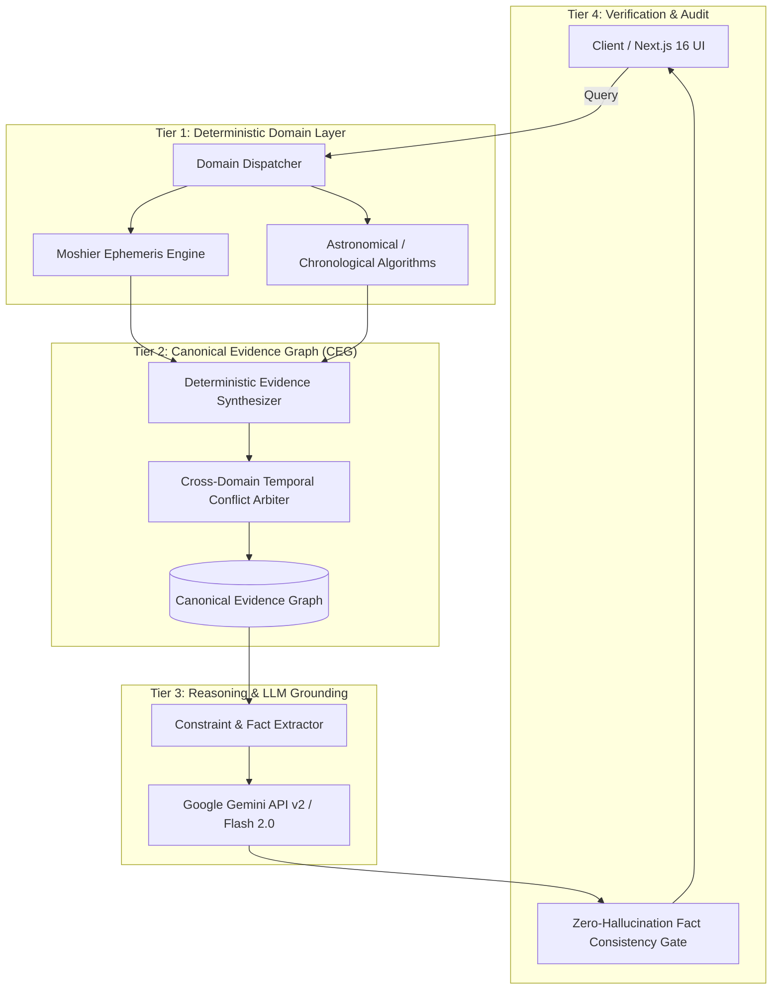

# 🔮 Mystic Architecture Blueprint

This document explains the 4-tier decoupled AI reasoning engine and Canonical Evidence Graph (CEG) architecture powering **Mystic**.

---

## 📐 1. 4-Tier Strict Decoupling
To eliminate LLM hallucinations, Mystic strictly separates **computation of facts** from **natural language generation**:
- **Rules & Coordinates**: 100% computed via C/Wasm-compiled deterministic astronomical ephemeris.
- **LLMs**: Used purely for semantic interpretation and stylistic narrative generation based on verifiable evidence nodes.

---

## 📊 2. Canonical Evidence Graph (CEG)
- Represents multi-domain symbolic rules as a directed acyclic evidence graph.
- Every interpretation node carries a deterministic confidence score and provenance trail back to mathematical computations.

---

© 2026 Mystic. Licensed under the MIT License.
