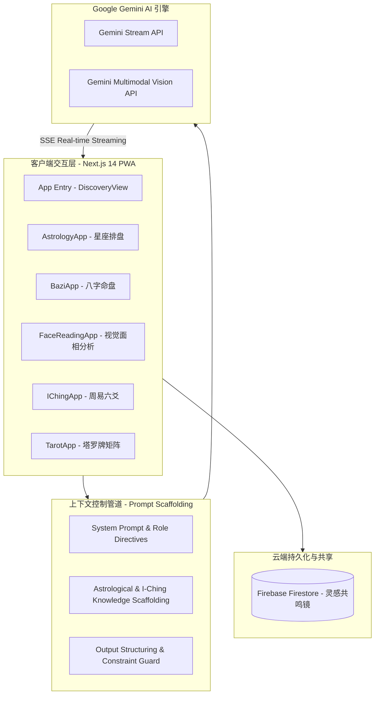
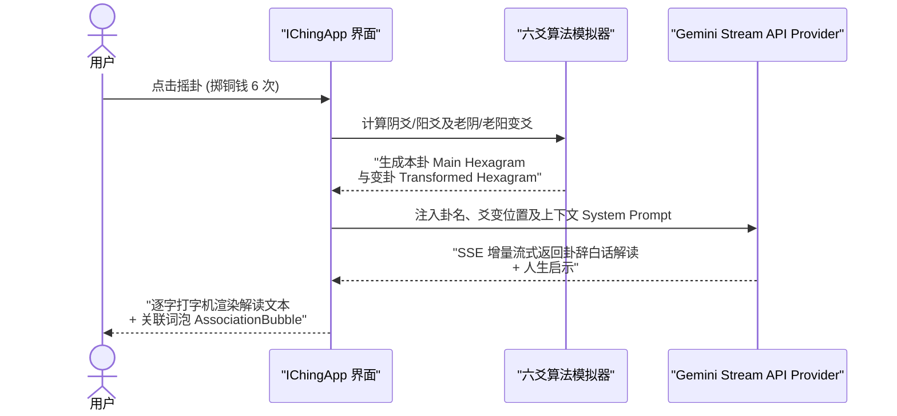

# 🔮 Mystic - Gemini Multimodal AI Wisdom & Astrology Suite

[](LICENSE)
[](https://nextjs.org/)
[](https://ai.google.dev/)
[](https://firebase.google.com/)

[🇨🇳 中文](README.md) | [🇺🇸 English](README_EN.md)

---

## 🎬 产品截图

<p align="center">
  <em>📌 在此处放置 PWA 首页、星座排盘、八字命盘、塔罗牌阵等功能的截图或 GIF 动图。</em><br/>
  <em>（参考标杆仓库 kitao/pyxel：多图网格布局，视觉冲击力最强）</em>
</p>

---

## 📖 项目简介

**Mystic** 是一款基于 **Next.js 14 App Router** 架构构建的高性能多模态 AI 东方玄学与西方星象智慧探索平台。

系统深度集成了 **Gemini Stream API** 与 **Gemini Vision API**，结合自定义的"Prompt Context Pipeline（上下文约束管道）"，构建了包含西方占星排盘、东方八字命盘、视觉相学面相分析、周易六十四卦卜筮、紫微斗数、AI 塔罗牌占卜、梦境解析以及集体意识共鸣镜（Collective Mirror）在内的八大智慧推理模态。

系统的核心亮点在于**零幻觉 Prompt Context 管道控制**、**实时 SSE 流式响应渲染**、**视觉图像多模态推理**以及完整的 **PWA 渐进式 Web 应用架构支持**。

---

## 🛠️ 核心架构设计与工程实践 (Architecture & Design)

以下架构模块均在本项目中进行了完整的实现与落地，点击对应模块中的源码直链，即可查阅底层的核心代码实现细节：

### 1. 多模态 AI 推理与上下文约束管道 (Multimodal AI & Context Control Pipeline) 🌌

*   **架构演进与思考**：针对传统 LLM 在复杂推演场景下容易产生的逻辑混乱与幻觉问题，系统设计了上下文约束管道（Context Control Pipeline）。每次推理请求均会在后台拼接结构化的系统指令（System Instructions）、领域知识库约束以及用户输入的时空/面相参数，确保大模型输出具备极高专业度与一致性的结构化解读。
*   **多模态推理架构图**：



*   **📂 核心源码直链**：
    - [app/components/DiscoveryView.tsx (多模态探索导航与模块路由主控)](app/components/DiscoveryView.tsx)
    - [app/components/AstrologyApp.tsx (西方占星计算与 Gemini 交互引擎)](app/components/AstrologyApp.tsx)
    - [app/components/BaziApp.tsx (东方八字干支推算与 Gemini 解读引擎)](app/components/BaziApp.tsx)
    - [app/components/FaceReadingApp.tsx (Gemini Multimodal Vision 面相图像分析)](app/components/FaceReadingApp.tsx)
    - [app/components/IChingApp.tsx (周易六爻摇卦与变卦推演引擎)](app/components/IChingApp.tsx)
    - [app/components/TarotApp.tsx (塔罗牌阵与 AI 牌意联想分析组件)](app/components/TarotApp.tsx)

---

### 2. 八大智慧分析模态与处理时序 (Wisdom Engine Subsystems) ☯️

系统将东西方传统推演智慧与现代 AI 进行了深度融合，各子模块具体实现如下：

1.  **🌌 占星排盘 (AstrologyApp)**：输入出生年月日时与经纬度，动态计算行星相位与宫位落点，调用 Gemini 进行双人合盘与运势预测。
2.  **🎋 东方八字 (BaziApp)**：精确推算年柱、月柱、日柱、时柱天干地支，结合五行旺衰进行格局分析。
3.  **👁️ 视觉面相 (FaceReadingApp)**：通过 Gemini Vision API 直接解析用户上传的面部照片，识别面部三庭五眼特征与气色印记。
4.  **☯️ 周易卜筮 (IChingApp)**：模拟三枚铜钱摇卦过程，生成本卦与变卦，结合《易经》卦辞进行变爻解析。
5.  **🎴 塔罗占卜 (TarotApp)**：包含单牌解读与经典三牌牌阵，实时渲染卡牌翻转动画与灵感词泡。
6.  **🌙 梦境解析 (DreamApp)**：基于精神分析与意象符码库，输入梦境文本生成心理隐喻映射图。
7.  **✨ 紫微斗数 (ZiWeiApp)**：推算十二宫位主星落点与四化飞星。
8.  **🪞 灵感共鸣镜 (CollectiveMirrorApp)**：连接 Firebase Firestore，实现全球用户顿悟感悟的实时匿名投射与词云共鸣。

*   **摇卦与变卦推演时序图 (I-Ching Sequence Flow)**：



*   **📂 核心源码直链**：
    - [app/components/CollectiveMirrorApp.tsx (基于 Firebase 的集体共鸣镜实现)](app/components/CollectiveMirrorApp.tsx)
    - [app/components/AssociationBubble.tsx (实时流式响应联想词泡组件)](app/components/AssociationBubble.tsx)
    - [firestore.rules (Firebase 安全规则策略文件)](firestore.rules)

---

## 📂 项目结构 (Project Structure)

```text
mystic/
├── app/                            # Next.js 14 App Router 页面与组件
│   ├── actions/                    # Next.js Server Actions (AI API 代理)
│   ├── api/                        # SSE 流式 Endpoint
│   ├── components/                 # 核心模块组件库
│   │   ├── AstrologyApp.tsx        # 占星模态
│   │   ├── BaziApp.tsx             # 八字模态
│   │   ├── FaceReadingApp.tsx      # 面相 Vision 模态
│   │   ├── IChingApp.tsx           # 易经卦象模态
│   │   ├── TarotApp.tsx            # 塔罗牌模态
│   │   ├── CollectiveMirrorApp.tsx # 集体意识镜模态
│   │   ├── AssociationBubble.tsx   # 动态词泡组件
│   │   └── DiscoveryView.tsx       # 首页模块集成导航
│   ├── globals.css                 # 渐变与 Glassmorphism 全局样式
│   ├── layout.tsx                  # PWA Manifest 与 Root Layout
│   └── page.tsx                    # 视图入口
├── firebase-applet-config.json     # Firebase 实时云端配置
├── firestore.rules                 # Firestore 数据库读写安全规则
├── GEMINI.md                       # 架构规范与 Context Prompt 设计
└── README.md                       # 本说明文档
```

---

## 📊 技术栈选型 (Technology Stack)

| 层级 | 核心技术 | 作用 |
|:------|:-----------|:--------|
| **前端应用框架** | Next.js 14 (App Router) + React 18 | 现代化 React 全栈应用框架 |
| **核心 AI 引擎** | Google Gemini API (Stream & Vision) | 实时 SSE 流式推理与多模态图像识别 |
| **实时云数据库** | Firebase Firestore | 匿名集体共鸣镜数据实时广播与同步 |
| **样式与视觉设计**| TailwindCSS + Glassmorphism UI | 极具未来感的深色调水晶流体视觉设计 |
| **PWA 跨端体验** | Service Worker + PwaInstallPrompt | 支持手机端一键添加到主屏幕体验 |

---

## 🏃 本地开发与启动指南

### 1. 环境准备
- **Node.js**: 18.0 或更高版本
- **Gemini API Key**: 前往 [Google AI Studio](https://aistudio.google.com/) 获取 API Key

### 2. 安装依赖
```bash
git clone https://github.com/MeiSiristhebest/mystic.git
cd mystic
npm install
```

### 3. 配置环境变量
在项目根目录下新建 `.env.local` 文件，配置 Gemini API Key：
```env
GEMINI_API_KEY="your-google-gemini-api-key"
```

### 4. 启动本地开发服务器
```bash
npm run dev
```

打开浏览器访问 `http://localhost:3000`，即可预览完整系统。

**预期输出**：
```bash
▲ Next.js 14.x.x
- Local:        http://localhost:3000
- Environments: .env.local
✓ Ready in XXX ms
```

---

## 🤝 参与贡献

欢迎贡献代码。简要流程：

```bash
# 1. Fork → Clone → 切分支
git checkout -b feat/your-feature

# 2. 本地构建通过
npm run build

# 3. Commit 并提 PR
git commit -m "feat: your change"
git push origin feat/your-feature
```

**欢迎贡献的方向**：
- 🌐 新增智慧模态（如梅花易数、星盘比对等）
- 🧪 补充 Server Action 与组件单元测试
- 🎨 视觉细节打磨或新主题样式
- 📱 PWA 离线体验增强

---

## 🔒 安全说明

| 风险场景 | 防护措施 |
|---------|---------|
| **Gemini API Key 泄露** | `.env.local` 已加入 `.gitignore`；Server Action 作为唯一 API 代理出口，Key 仅在服务端使用，从不暴露给浏览器 |
| **Firestore 越权读写** | `firestore.rules` 严格控制读写权限；匿名共鸣镜仅允许写入匿名字段，读权限基于文档 ID |
| **Prompt 注入攻击** | Context Control Pipeline 多层 System Prompt 约束；输出 Sanitizer 护栏校验结构化格式 |
| **PWA Service Worker 缓存污染** | 生产构建时哈希化静态资源；Service Worker 更新策略采用 `skipWaiting` + `clientsClaim` 渐进替换 |

**漏洞上报**：发现安全问题请直接发邮件至 **`mystic-security [at] googlegroups [dot] com`**，不要公开在 Issue 里。承诺 **24 小时内首次响应**。

---

## 📜 许可证 (License)

基于 **MIT License** 开源协议。详见 [LICENSE](LICENSE) 文件。
