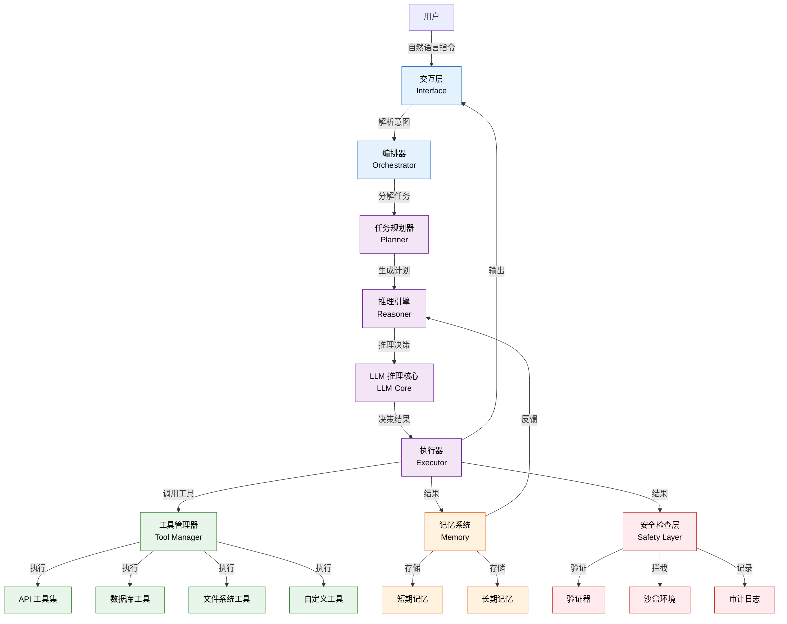
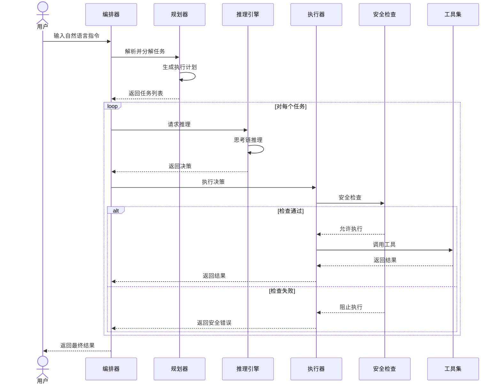

# ✨ Mystic

<p align="center">
  <strong>A Python-based AI framework for building autonomous agents with LLM-powered decision-making</strong>
</p>

<p align="center">
  <a href="https://github.com/MeiSiristhebest/mystic/actions/workflows/ci.yml"></a>
  <a href="https://github.com/MeiSiristhebest/mystic/blob/main/LICENSE"></a>
  
  
  
  
</p>

---

<p align="center">
  <a href="README.md">🇨🇳 中文</a> &nbsp;·&nbsp; <a href="README_EN.md">🇺🇸 English</a>
</p>

---

## 🌟 项目简介

**Mystic** 是一个基于 Python 的 AI 框架，用于构建具备自主决策能力的 AI Agent。它通过大语言模型（LLM）驱动的决策引擎，使 Agent 能够理解复杂指令、规划执行步骤、调用外部工具，并在不确定的环境中做出智能判断。

Mystic 的核心理念是 **"Think Before You Act"（先思考，再行动）**。每个 Agent 在执行任务前都会进行内部推理，评估多种行动方案，选择最优策略，并从执行结果中学习改进。

---

## 🛠️ 核心特性

| 特性 | 说明 |
|------|------|
| 🧠 **LLM 驱动的推理引擎** | 基于主流大语言模型的思考链（Chain-of-Thought）推理 |
| 🎯 **自主决策** | Agent 能独立评估环境状态，选择最优行动方案 |
| 🔧 **工具调用** | 支持 Agent 调用外部 API、数据库、文件系统等工具 |
| 🔄 **记忆系统** | 短期记忆 + 长期记忆，Agent 能记住历史交互并从中学习 |
| 🛡️ **行动验证** | 在行动前进行安全检查，防止 Agent 执行危险操作 |
| 📊 **可观测性** | 完整的执行日志和轨迹记录，便于调试和优化 |
| ⚡ **异步支持** | 全异步架构，支持并发执行 |
| 🧩 **插件体系** | 可扩展的插件系统，轻松添加新能力 |

---

## 🏗️ 架构设计

### 整体架构



### Agent 执行流程



---

## 📦 项目结构

```text
mystic/
├── mystic/                         # 核心包
│   ├── __init__.py
│   ├── agent/                      # Agent 核心实现
│   │   ├── base_agent.py           # 基础 Agent 类
│   │   ├── planner.py              # 任务规划器
│   │   ├── reasoner.py             # 推理引擎
│   │   └── executor.py             # 执行器
│   ├── memory/                     # 记忆系统
│   │   ├── short_term.py           # 短期记忆
│   │   ├── long_term.py            # 长期记忆
│   │   └── manager.py              # 记忆管理器
│   ├── tools/                      # 工具集
│   │   ├── api_tools.py            # API 调用工具
│   │   ├── db_tools.py             # 数据库工具
│   │   ├── file_tools.py           # 文件系统工具
│   │   └── custom.py               # 自定义工具基类
│   ├── safety/                     # 安全检查
│   │   ├── validator.py            # 行动验证器
│   │   ├── sandbox.py              # 沙盒环境
│   │   └── audit.py                # 审计日志
│   ├── llm/                        # LLM 集成
│   │   ├── base_provider.py        # LLM 提供商基类
│   │   ├── openai_provider.py      # OpenAI 提供商
│   │   └── config.py               # LLM 配置
│   └── utils/                      # 工具函数
│       ├── logging.py              # 日志工具
│       └── helpers.py              # 辅助函数
├── examples/                       # 示例代码
│   ├── simple_agent.py             # 简单 Agent 示例
│   ├── tool_use.py                 # 工具调用示例
│   └── custom_agent.py             # 自定义 Agent 示例
├── tests/                          # 测试
├── docs/                           # 文档
├── pyproject.toml                  # 项目配置
└── README.md
```

---

## 🚀 快速开始

### 安装

```bash
# 从 PyPI 安装（推荐）
pip install mystic-framework

# 或从源码安装
git clone https://github.com/MeiSiristhebest/mystic.git
cd mystic
pip install -e .
```

### 基本用法

```python
import asyncio
from mystic import Agent
from mystic.llm import LLMConfig

# 配置 LLM
llm_config = LLMConfig(
    provider="openai",
    model="gpt-4o",
    api_key="your-api-key"
)

# 创建 Agent
agent = Agent(
    name="my-agent",
    llm_config=llm_config,
    tools=["file", "api", "database"]
)

async def main():
    # 运行 Agent
    result = await agent.run(
        "读取 data/input.csv 文件，分析数据并生成摘要报告，保存为 output/summary.txt"
    )
    print(result)

asyncio.run(main())
```

### 使用自定义工具

```python
from mystic.tools import CustomTool

class WeatherTool(CustomTool):
    name = "weather"
    description = "获取指定城市的天气信息"
    parameters = {
        "city": {"type": "string", "description": "城市名称"}
    }

    async def execute(self, city: str) -> dict:
        # 实现天气查询逻辑
        response = await self.http_client.get(
            f"https://api.weather.com/{city}"
        )
        return {"city": city, "temperature": response["temp"]}

# 注册自定义工具
agent.register_tool(WeatherTool())

# 使用
result = await agent.run("查询北京今天的天气")
```

### 多 Agent 协作

```python
from mystic import Agent, Orchestrator

# 创建多个 Agent
researcher = Agent(name="researcher", tools=["web", "database"])
writer = Agent(name="writer", tools=["file"])
critic = Agent(name="critic", tools=["file"])

# 创建编排器
orchestrator = Orchestrator(
    agents=[researcher, writer, critic],
    collaboration_mode="sequential"  # 或 "parallel"
)

# 运行多 Agent 协作
result = await orchestrator.run(
    "研究量子计算的最新进展，撰写一篇科普文章，然后进行批判性审阅"
)
```

---

## ⚙️ 配置说明

### LLM 提供商配置

```python
from mystic.llm import LLMConfig

# OpenAI
config = LLMConfig(
    provider="openai",
    model="gpt-4o",
    api_key="your-api-key",
    temperature=0.7,
    max_tokens=4096
)

# 其他提供商
config = LLMConfig(
    provider="anthropic",
    model="claude-sonnet-4-20250514",
    api_key="your-api-key"
)
```

### 安全配置

```python
from mystic.safety import SafetyConfig

safety_config = SafetyConfig(
    enable_sandbox=True,
    max_api_calls=10,
    blocked_patterns=["rm -rf /", "DROP TABLE"],
    require_human_approval=True,
    audit_all_actions=True
)

agent = Agent(
    llm_config=llm_config,
    safety_config=safety_config
)
```

### 记忆配置

```python
from mystic.memory import MemoryConfig

memory_config = MemoryConfig(
    short_term_capacity=100,
    long_term_enabled=True,
    embedding_model="text-embedding-3-small",
    max_history_days=90
)

agent = Agent(
    llm_config=llm_config,
    memory_config=memory_config
)
```

---

## 🔒 安全

### 使用须知

- **API Key 安全**：切勿将 API Key 硬编码在代码中，请使用环境变量或密钥管理服务。
- **权限控制**：生产环境请为 Agent 配置最小权限原则，仅开放必要的工具。
- **沙盒执行**：危险操作务必在沙盒环境中执行，避免对生产系统造成影响。
- **审计日志**：启用审计日志功能，记录 Agent 的所有行动轨迹。
- **人工审核**：关键决策点建议启用人工审核模式。

### 漏洞上报

请发送邮件至 **`maox_neta@foxmail.com`**；我们承诺在 48 小时内首次回复，关键漏洞 72 小时内修复并致谢。

---

## 📄 许可证

**Mystic** 基于 **MIT License** 开源。这意味着：

- ✅ 你可以自由地修改、商用、闭源分发本项目
- ✅ 衍生作品只需保留一份版权声明与 MIT 原文
- ❌ 作者不对任何直接/间接使用损失承担责任

**版权声明：** Copyright (c) 2025-2026 MeiSiristhebest. All Rights Reserved.

完整许可证原文请参阅仓库根目录下的 [`LICENSE`](LICENSE) 文件。
