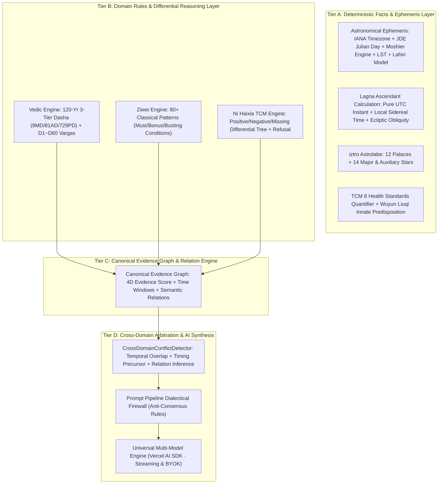

<!-- 
  Designed & Built with ❤️ by MeiSiristhebest (https://github.com/MeiSiristhebest)
  If this repository helps your learning or engineering, please consider dropping a ⭐ Star!
-->
<h1 align="center">🔮 Mystic</h1>

<p align="center">
  <b>English | <a href="./README_zh.md">简体中文</a></b>
</p>

> [!TIP]
> 💡 **If this architecture, engineering implementation, or toolchain helps your learning or workflow, please drop a ⭐ Star!**
> 📚 Explore the technical blueprint: [ARCHITECTURE.md](./ARCHITECTURE.md)

<p align="center">
  <b>Multi-Domain AI Wisdom & Interpretable Reasoning Suite</b>
</p>

<p align="center">
  <a href="LICENSE"></a>
  <a href="https://nextjs.org/"></a>
  <a href="https://sdk.vercel.ai/"></a>
</p>

---

<p align="center">
  <strong>Deterministic Domain & Evidence-Grounded Multi-Domain AI Reasoning Engine</strong><br/>
  <em>4-Tier Decoupled Architecture · Moshier Ephemeris & IANA Timezone Engine · Differential TCM Diagnosis · Evidence Relation Graph · Deterministic Evidence Calibration Score · Cross-Domain Dialectical Arbitration</em>
</p>

<p align="center">
  
</p>

---

## Table of Contents

- [About the Project](#about-the-project)
- [Capabilities & Scope Matrix](#capabilities--scope-matrix)
- [4-Tier Decoupled Architecture](#4-tier-decoupled-architecture)
- [Deterministic Domain Engines](#deterministic-domain-engines)
  - [1. Vedic Jyotish & Ephemeris Engine](#1-vedic-jyotish--ephemeris-engine)
  - [2. Ni Haixia Differential TCM Engine](#2-ni-haixia-differential-tcm-engine)
  - [3. Ziwei Doushu Astrolabe Engine](#3-ziwei-doushu-astrolabe-engine)
  - [4. Evidence Relation Graph & Cross-Domain Dialectics](#4-evidence-relation-graph--cross-domain-dialectics)
- [Automated Verification & CI Harness](#automated-verification--ci-harness)
- [License & Upstream Notices](#license--upstream-notices)
- [Installation & Setup](#installation--setup)

---

## About the Project

**Mystic** is a **multi-domain structured and interpretable AI reasoning engine** built on **Next.js 16 (App Router)**, **React 19**, **TypeScript 6**, and **Vercel AI SDK (Multi-Model Engine supporting DeepSeek, Claude, GPT-4o, Gemini, Ollama & Custom BYOK)**.

Traditional metaphysical/astrology AI applications dump raw birth information or subjective user questions directly into an LLM prompt, inevitably causing Barnum-effect platitudes, hallucinations, and false cross-domain consensus.

**Mystic refuses to be a naive prompt wrapper.** It establishes a strict deterministic computation and reasoning firewall between user interaction and LLM synthesis:
1. **Deterministic Ephemeris & Astronomical Truth**: IANA Timezone with DST normalization, Julian Days (JD), Moshier astronomical ephemeris, Local Sidereal Time (LST), and Chitrapaksha (Lahiri) linear precession are computed via mathematical algorithms with fail-fast guarantees (no fake static planet fallbacks).
2. **Deterministic Rules & Differential Diagnostics**: TCM positive/negative exclusion trees, refusal on insufficient evidence, Ziwei 80+ patterns, and Vedic 7-Chara Karakas are evaluated deterministically with authentic classical citations.
3. **Canonical Evidence Graph with Inferred Relations**: Every insight is anchored to a structured `CanonicalEvidenceNode` with 4-dimensional deterministic evidence calibration score (`calculation`, `inputCompleteness`, `ruleMatch`, `sourceAuthority`) and active semantic relation edges (`corroborating`, `contradicting`, `timing_precursor`, `surface_vs_root`, `temporally_separate`).
4. **Cross-Domain Temporal Tension Arbitration**: Evaluates real tensions across disciplines within overlapping time windows, instructing the LLM to provide dialectical depth without forced consensus.

---

## Capabilities & Scope Matrix

For technical honesty and architectural clarity, the table below specifies the exact implementation boundaries of Mystic:

| Domain Module | ✅ Fully Implemented Capabilities | ⚠️ Simplified / Partial Capabilities | ❌ Out of Scope / Not Included |
| :--- | :--- | :--- | :--- |
| **Ziwei Doushu** | 12 Palaces, 108 Stars, San Fang Si Zheng, 80+ Classical Patterns (Must / Bonus / Busting conditions), 1:1 iztro differential parity testing | Decadal flow-star overlays | Flying Star 14 Mutagen Palace transformations (San He classic school prioritized) |
| **Vedic Jyotish** | IANA Timezone & DST normalization, JD calculation, Moshier 9-Grahas true longitudes, Fail-Fast error assertions, Lahiri linear precession model, pure UTC Lagna, 27 Nakshatras & Padas, 120-Yr 3-Tier Recursive Vimshottari (9MD/81AD/729PD), 7-Chara Karakas, D1/D7/D9/D10/D12/D60 Vargas, **Birth Time Rectifier Heuristics**, **Prashna Horary Rule Engine**, **Ashtakuta Key Compatibility Dimensions (Simplified Synastry Model)** | Basic Ashtakavarga and qualitative Shadbala | Native C++ Swiss Ephemeris (`pysweph`) bindings, Full JHora 15-divisional desktop-grade calculations |
| **Ni Haixia TCM** | Positive indicators, Negative contra-indicators, 5-core missing observations refusal (`insufficient_evidence`), 100% authentic *Shanghan Lun* / *Jingui Yaolüe* citations, 8 Health Standards quantification, **Deep Pulse & Tongue Differential Engine**, **Classical Formula Modifications Matrix** | 6-Stages candidate syndrome scoring and ranking | Medical prescriptions (System is strictly designed for traditional literature study & philosophical reasoning, never for medical advice) |
| **Evidence & Dialectics** | Canonical Evidence Graph (CEG), Multi-dimensional Evidence Quality Matrix (Calculation / Input / Rule / Scripture Tier), Epistemic Caps, `temporalScope` boundaries, Cross-Domain Conflict Detector, Prompt Firewall, Dynamic Relation Inference (`inferEvidenceRelations`) | Subgraph graph traversal pruning | Automated formal verification on arbitrary free-form natural language claims |

---

## 4-Tier Decoupled Architecture



---

## Deterministic Domain Engines

### 1. Vedic Jyotish & Ephemeris Engine
- **Astronomical Ephemeris & IANA Timezones**: Converts any global IANA timezone (e.g. `Asia/Shanghai`, `America/New_York`) and DST to UTC Instant, calculating real geocentric longitudes and retrograde statuses for the 9 Grahas via Moshier astronomical algorithms.
- **Fail-Fast Quality Guarantees**: Rejects fake static approximations by throwing `EphemerisCalculationError` on calculation issues.
- **Sidereal Lagna**: Uses pure UTC Instant, Local Sidereal Time, and Chitrapaksha (Lahiri) linear precession.
- **120-Year 3-Tier Recursive Dasha**: Seamless timeline across 9 Mahadashas $\to$ 81 Antardashas $\to$ 729 Pratyantardashas.
- **Extended Vargas**: D1 (Natal), D7 (Saptamsa), D9 (Navamsa), D10 (Dasamsa), D12 (Dwadasamsa), D60 (Shashtiamsa) sign mappings.
- **7-Chara Karakas**: Descending order from Atmakaraka (AK) to Darakaraka (DK).

### 2. Ni Haixia Differential TCM Engine
- **Differential Protocol**: Evaluates positive indicators, negative exclusion contraindications, and missing clinical observations.
- **Refusal on Insufficient Evidence**: Rejects false diagnoses when symptoms are vague, returning an exact checklist of missing observations instead of defaulting to a formula.
- **Authentic Classical Lore**: Direct citations from *Shanghan Lun* and *Jingui Yaolüe* for cultural and literature research.

### 3. Ziwei Doushu Astrolabe Engine
- **Full Astrolabe Deconstruction**: 12 Palaces, 108 Stars, Body Palace, San Fang Si Zheng, Mutagens (Si Hua), and Decadal Luck via `iztro`.
- **80+ Classical Patterns**: Rigorous evaluation of auspicious, neutral, and afflicted configurations.

### 4. Evidence Relation Graph & Cross-Domain Dialectics
- **Deterministic Evidence Calibration Score**:
  $$\text{Weighted Mean} = 0.35 \times \text{Calc} + 0.25 \times \text{Input} + 0.25 \times \text{Rule} + 0.15 \times \text{Source}$$
  $$\text{Overall} = \min(\text{Weighted Mean}, \min(\text{Calc}, \text{Input}, \text{Rule}) + 0.15)$$
- **⚠️ Epistemic Semantic Definition**: The evidence calibration score (`confidence` / `overallEvidenceQuality`) strictly measures the **structural completeness and classical literature backing** of an Evidence Node within Mystic's internal knowledge framework. It **never represents empirical statistical correctness or real-world probability**.
- **Dynamic Semantic Relations**: Automatically populates `corroborating`, `contradicting`, `timing_precursor`, `surface_vs_root`, and `temporally_separate` relation edges across evidence nodes.
- **Anti-Consensus Firewall**: Guides the generative model to present honest dialectical synthesis rather than smoothing away contradictions.

---

## Automated Verification & CI Harness

Built with a 4-tier automated test harness wired directly into GitHub Actions:
* **L1 Execution Health**: Zero runtime exceptions in pure functional units.
* **L2 Structural Integrity**: 12 palaces, 14 major stars completeness, and 9/81/729 Dasha continuity.
* **L3 Domain Golden Values**: Multi-timezone assertions (Beijing, New Delhi, London with BST, New York), astronomical solar zodiac degrees, matched patterns, classical herbs, and refusal mechanics.
* **L4 Differential Testing**: 1:1 parity check between Mystic adapter and raw `iztro` engine.

```bash
# Run L3 Golden & L4 Differential Tests
pnpm test

# Run 4-Tier Full Regression Suite
pnpm test:all

# Full Typecheck & Production Build Verification
pnpm verify
```

---

## License & Acknowledgments
 
- The core codebase is licensed under the [MIT License](LICENSE).
- For third-party ephemeris dependencies (e.g. `ephemeris` GPL-3.0) and classical public domain literature notices, please refer to [NOTICE.md](NOTICE.md).
- **Open Source Reuse & Reference (Avoiding Reinventing the Wheel)**: Mystic's multi-domain deterministic reasoning architecture, Canonical Evidence Graph (CEG), and cross-system tension arbitration are original designs of the Mystic project. To avoid reinventing the wheel on domain rule bases and classical data assets, Mystic references and adapts components from:
  - [`nihaixia`](https://github.com/jangviktor-web/nihaixia): Classical formula datasets and 6-stages symptom mappings.
  - [`vedic-astro-skills`](https://github.com/CNWU16/vedic-astro-skills): Vedic astronomical Dasha recursive calculation workflows.
  - [`ziwei-doushu`](https://github.com/Renhuai123/ziwei-doushu): Classical astrolabe rules and Si Hua mutagen rule definitions.

---

## Installation & Setup

* **Node.js**: `>= 22.13` (Node 22 LTS recommended)
* **Package Manager**: `pnpm >= 11.1.2` (with native Corepack support)

```bash
# 1. Clone repository
git clone https://github.com/MeiSiristhebest/mystic.git
cd mystic

# 2. Enable Corepack and install dependencies
corepack enable
pnpm install

# 3. Configure environment variables (.env.local)
DEFAULT_AI_PROVIDER=gemini
GEMINI_API_KEY=your_gemini_api_key
# Or use any other provider (Anthropic, OpenAI, DeepSeek, Ollama, Custom BYOK):
# ANTHROPIC_API_KEY=your_anthropic_key
# OPENAI_API_KEY=your_openai_key
# DEEPSEEK_API_KEY=your_deepseek_key

# 4. Start local development server
pnpm dev
```

---

## ⭐ Star & Support

If you find this project useful or inspiring, please consider giving it a ⭐ **Star** on GitHub! It helps more developers discover the work and supports continuous open-source maintenance.

<p align="center">
  <a href="https://www.star-history.com/?repos=MeiSiristhebest%2Fmystic&type=date&legend=bottom-right">
    <picture>
      <source media="(prefers-color-scheme: dark)" srcset="https://api.star-history.com/chart?repos=MeiSiristhebest/mystic&type=date&theme=dark&legend=bottom-right&sealed_token=uaVldQgHazK-DcCE89936BEzAUE1ErdhsQqB7B583EJxvNyhoxZkU2soE6gCjSGsdn5TpVFHAzFZx8D-0S5bVhb8lmr1rrsJOU_UV3x9DqHUQ-cQJYtXBw" />
      <source media="(prefers-color-scheme: light)" srcset="https://api.star-history.com/chart?repos=MeiSiristhebest/mystic&type=date&legend=bottom-right&sealed_token=uaVldQgHazK-DcCE89936BEzAUE1ErdhsQqB7B583EJxvNyhoxZkU2soE6gCjSGsdn5TpVFHAzFZx8D-0S5bVhb8lmr1rrsJOU_UV3x9DqHUQ-cQJYtXBw" />
      
    </picture>
  </a>
</p>

### 🤝 Contributors
<a href="https://github.com/MeiSiristhebest/mystic/graphs/contributors">
  
</a>

<!-- Scarf Telemetry Pixel -->

