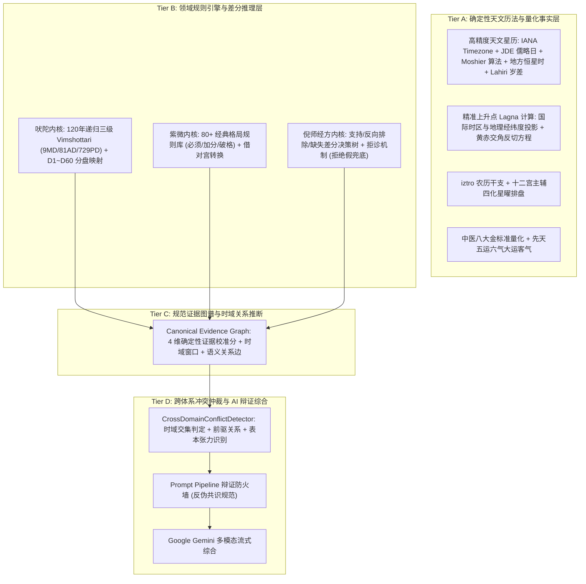

# 🔮 Mystic - Multi-Domain AI Wisdom & Interpretable Reasoning Suite

<p align="center">
  <a href="LICENSE"></a>
  <a href="https://nextjs.org/"></a>
  <a href="https://ai.google.dev/"></a>
  <a href="https://github.com/MeiSiristhebest/mystic/actions"></a>
</p>

<p align="center">
  <a href="README.md">🇨🇳 中文</a> &nbsp;|&nbsp; <a href="README_EN.md">🇺🇸 English</a>
</p>

---

<p align="center">
  <strong>基于确定性事实约束与规范证据图谱的多领域可解释 AI 推演引擎</strong><br/>
  <em>四层解耦架构 · Moshier 天文星历与 IANA 时区中枢 · 差分辨证决策树 · 证据时域关系图谱 · 确定性证据校准分 · 跨体系时空张力仲裁</em>
</p>

<p align="center">
  
</p>

---

## 目录 (Table of Contents)

- [项目简介 (About)](#项目简介-about)
- [领域能力实现边界矩阵 (Capabilities & Scope Matrix)](#领域能力实现边界矩阵-capabilities--scope-matrix)
- [核心架构：四层解耦模型 (Architecture)](#核心架构四层解耦模型-architecture)
- [核心领域推演引擎 (Domain Engines)](#核心领域推演引擎-domain-engines)
  - [1. 吠陀占星天文与运势内核 (Vedic Jyotish & Ephemeris Engine)](#1-吠陀占星天文与运势内核-vedic-jyotish--ephemeris-engine)
  - [2. 倪海厦经方差分辨证系统 (Ni Haixia Differential TCM Engine)](#2-倪海厦经方差分辨证系统-ni-haixia-differential-tcm-engine)
  - [3. 紫微斗数排盘与格局引擎 (Ziwei Doushu Astrolabe Engine)](#3-紫微斗数排盘与格局引擎-ziwei-doushu-astrolabe-engine)
  - [4. 证据时域关系图谱与跨体系冲突仲裁 (Evidence Relation Graph & Dialectics)](#4-证据时域关系图谱与跨体系冲突仲裁-evidence-relation-graph--dialectics)
- [自动化验证与 CI 体系 (Verification & Quality Harness)](#自动化验证与-ci-体系-verification--quality-harness)
- [开源许可证与上游告示 (License & Notices)](#开源许可证与上游告示-license--notices)
- [环境要求与安装 (Installation & Setup)](#环境要求与安装-installation--setup)

---

## 项目简介 (About)

**Mystic** 是一套构建在 **Next.js 16 (App Router)**、**React 19**、**TypeScript 6** 与 **`@google/genai` (Gemini API v2)** 之上的**多领域结构化可解释 AI 推演引擎**。

传统的玄学与命理 AI 往往直接将出生日期或主观提问粗暴地作为 Prompt 丢给大语言模型，导致极易产生“巴纳姆效应”套话、事实捏造与虚假的多系统一致性幻觉。

**Mystic 拒绝简单的 Prompt 套壳。** 本项目在前端交互与大模型生成之间，建立了一套严密的**确定性计算与规则推理中枢**：
1. **真实天文与历法事实先行**：集成 IANA 国际时区与夏令时解析、儒略日（JD）、Moshier 天文星历、地方恒星时（LST）与 Lahiri 恒星黄道岁差模型，严禁任何伪静态行星 Fallback，确保底层输入客观真实。
2. **确定性规则树与差分判定**：中医正反指征排除法与缺失要素拒诊、紫微 80+ 经典格局规则、吠陀 7-Karaka 梯队，均由程序逻辑确定性产出。
3. **结构化证据图谱 (Canonical Evidence Graph)**：每条推演均携带由确定性数学公式加权聚合的 4 维证据校准分（`calculation`, `inputCompleteness`, `ruleMatch`, `sourceAuthority`），以及动态推断的语义关系边（`corroborating`, `contradicting`, `timing_precursor`, `surface_vs_root`, `temporally_separate`）。
4. **跨体系张力与时空冲突仲裁**：识别多体系在相同时间窗口内的语义张力，通过 Prompt Firewall 强制指导 LLM 开展多视角辩证综合。

---

## 领域能力实现边界矩阵 (Capabilities & Scope Matrix)

为保持严谨的技术诚信，下表清晰界定 Mystic 当前版本的实现边界：

| 领域模块 | ✅ 完整实现的能力 | ⚠️ 简化/部分实现的能力 | ❌ 超出当前范围 / 未包含能力 |
| :--- | :--- | :--- | :--- |
| **紫微斗数** | 12 宫排盘、108 星曜、三方四正、80+ 经典格局判定、iztro 1:1 差分回归、**流年天干四化与流曜小限动态叠盘（三盘合一共振）**、**紫微双人合盘与生年四化跨盘互涉** | 动态虚星神煞微调 | 飞星派十四化飞宫（本项目坚持经典三合派） |
| **四柱八字** | 全球 IANA 时区与真太阳时（EoT 均时差 + 经度时角差）、严格节气换月换年（立春分界）、子初（23:00）换日、地支藏干、十神信号、12 个边界 Golden Fixtures | 细粒度格局强弱旺衰定局模型 | 盲派口诀、铁板神数 |
| **吠陀占星** | IANA 时区夏令时、JD 儒略日、Moshier 天文星历、Lahiri 岁差、27 月宿与 Pada、120 年全量 3 级递归 Vimshottari、7-Chara Karakas、D1/D7/D9/D10/D12/D60 分盘、**生时校正规则推演 (Rectifier Heuristic)**、**时事卜卦推演 (Prashna Rule Engine)**、**Ashtakuta 核心维度与关系特征评估（简化合盘模型）** | 基础 Ashtakavarga 定性 | C++ 原生 Swiss Ephemeris (`pysweph`) 绑定、JHora 桌面级 15 张全分盘精细运算 |
| **倪海厦中医** | 正向支持与反向排除差分决策、五大核心四诊缺失拒诊机制（`insufficient_evidence`）、八大金标准量化、五运六气、**脉象与舌象结构化差分交叉鉴别 (Deep Pulse & Tongue Differential)**、**经方剂量与加减化裁矩阵** | 六经层级候选证型评分与排序 | 临床处方开具（系统仅提供文献候选证型与理法文化研究，严禁作为医疗处方） |
| **证据与冲突仲裁** | 规范证据图谱（CEG）、多维证据质量矩阵（计算/输入/规则/原典分级）、认识论上限封顶、时间作用域、跨体系时空冲突检测器、Prompt Firewall 辩证防火墙、时域区间重叠与语义前驱关系推断 | 跨子图图遍历剪枝算法 | 任意自然语言 Claim 的完全自动化逻辑形式化验证 |

---

## 核心架构：四层解耦模型 (Architecture)



---

## 核心领域推演引擎 (Domain Engines)

### 1. 吠陀占星天文与运势内核 (Vedic Jyotish & Ephemeris Engine)
- **IANA 国际时区与天文星历**：支持全球标准 IANA 时区（如 `Asia/Shanghai`, `America/New_York`）与夏令时解析，基于 Moshier 天文算法精准解算九曜（Sun, Moon, Mars, Mercury, Jupiter, Venus, Saturn, Rahu, Ketu）真实真黄道度数与逆行态。
- **Fail-Fast 质量保障**：彻底废除静默伪行星近似 fallback，计算异常显式抛出 `EphemerisCalculationError`。
- **恒星黄道与上升点**：采用 Chitrapaksha (Lahiri) 线性岁差模型与地方恒星时解算 Lagna。
- **120 年全量三级 Dasha 递归**：精准推演 9 大运 (Maha) $\to$ 81 中运 (Antar) $\to$ 729 小运 (Pratyantar) 连续无缝时间轴。
- **扩展分盘 (Vargas)**：支持 D1 (本命), D7 (子息), D9 (九分婚恋), D10 (十分事业), D12 (父母), D60 (微细因果盘) 符号映射。
- **7-Chara Karaka**：按度数降序严密编排 Atmakaraka (灵魂星) 至 Darakaraka (伴侣星)。

### 2. 倪海厦经方差分辨证系统 (Ni Haixia Differential TCM Engine)
- **差分辨证协议**：引入正向支持（Positive）、反向排除（Negative Contraindications）与缺失信息追问（Missing Observations）。
- **坚决拒绝伪兜底**：彻底废除“无匹配即默认小柴胡汤”的粗糙逻辑；指征不足时明确返回 `insufficient_evidence` 并输出四诊追问清单。
- **文化文献研究定位**：直连《伤寒论》《金匮要略》100% 真实条文出处，严格声明仅作为古籍理法与文化研讨参考，严禁作医疗诊断凭据。

### 3. 紫微斗数排盘与格局引擎 (Ziwei Doushu Astrolabe Engine)
- **12 宫 108 星曜全盘解构**：基于 iztro 纯 TypeScript 算法，严密计算十二宫、身宫、三方四正、大限流年与四化互冲。
- **80+ 经典格局规则库**：覆盖君臣庆会、杀破狼、机月同梁、三奇加会、日月同宫、日照雷门等经典上中下格与破格条件判定。

### 4. 证据时域关系图谱与跨体系冲突仲裁 (Evidence Relation Graph & Dialectics)
- **确定性证据校准分数学模型 (Deterministic Evidence Score)**：
  $$\text{Weighted Mean} = 0.35 \times \text{Calc} + 0.25 \times \text{Input} + 0.25 \times \text{Rule} + 0.15 \times \text{Source}$$
  $$\text{Overall} = \min(\text{Weighted Mean}, \min(\text{Calc}, \text{Input}, \text{Rule}) + 0.15)$$
- **⚠️ 证据分语义界定**：本系统的证据校准分（`confidence` / `overallEvidenceQuality`）严格表示 Mystic 内部的**结构化证据完整度与文献支持质量**，用于衡量计算完备性、输入充分度与原典层级，**绝不代表现实事件的统计预测准确率或科学概率**。
- **时域感知动态语义关系推断**：自动为证据节点建立 `corroborating`（同频印证）、`contradicting`（时域交集分歧）、`timing_precursor`（时机前驱承接）、`surface_vs_root`（表本张力）、`temporally_separate`（跨时段相位差）等语义关系。
- **反伪共识防火墙**：强制 LLM 呈现各体系不同视角的立论依据，输出富有哲理与辩证深度的决策建议。

---

## 自动化验证与 CI 体系 (Verification & Quality Harness)

项目内置 4 层自动化质量门禁体系（接入 GitHub Actions）：
* **L1 运行健全性测试**：确保所有模块纯函数安全执行、零未捕获异常。
* **L2 结构完整性校验**：12 宫完整性、14 主星落宫无遗漏、9/81/729 Dasha 连续无重叠校验。
* **L3 领域黄金真值断言**：涵盖国际多时区（北京、新德里、伦敦、纽约）星历断言、纯 UTC 西洋上升点与太阳黄经、必命中格局、古籍经方组成及缺失指征拒绝机制。
* **L4 外部引擎差分测试**：将 Mystic 适配器排盘与 `iztro` 原始底层核心进行 1:1 差分比对。

```bash
# 运行 L3 Golden 与 L4 Differential 领域测试
pnpm test

# 运行 4-Tier 全维回归测试
pnpm test:all

# 全量编译与验证
pnpm verify
```

---

## 开源许可证与致谢 (License & Acknowledgments)

- 本项目核心代码采用 [MIT License](LICENSE) 开源许可证。
- 详细第三方依赖（如 `ephemeris` GPL-3.0 Moshier 算法）与古籍公共文献声明，请参见 [NOTICE.md](NOTICE.md)。
- **灵感与致谢 (Inspirations)**：Mystic 的领域适配器在概念与知识建模上吸取了开源社区优秀项目的启发：
  - [`nihaixia`](https://github.com/jangviktor-web/nihaixia)：倪海厦先生经方医学体系与六经辨证整理思路。
  - [`vedic-astro-skills`](https://github.com/CNWU16/vedic-astro-skills)：吠陀占星天文计算与 Agent 化技能体系设计理念。
  - [`ziwei-doushu`](https://github.com/Renhuai123/ziwei-doushu)：紫微斗数排盘规则与经典格局知识工程建模。

---

## 环境要求与安装 (Installation & Setup)

* **Node.js**：`>= 22.13` (推荐 Node 22 LTS)
* **Package Manager**：`pnpm >= 11.1.2` (自带 Corepack 支持)

```bash
# 1. 克隆代码仓库
git clone https://github.com/MeiSiristhebest/mystic.git
cd mystic

# 2. 启用 Corepack 并安装依赖
corepack enable
pnpm install

# 3. 配置环境变量 (.env.local)
GEMINI_API_KEY=your_gemini_api_key

# 4. 启动本地开发服务
pnpm dev
```
