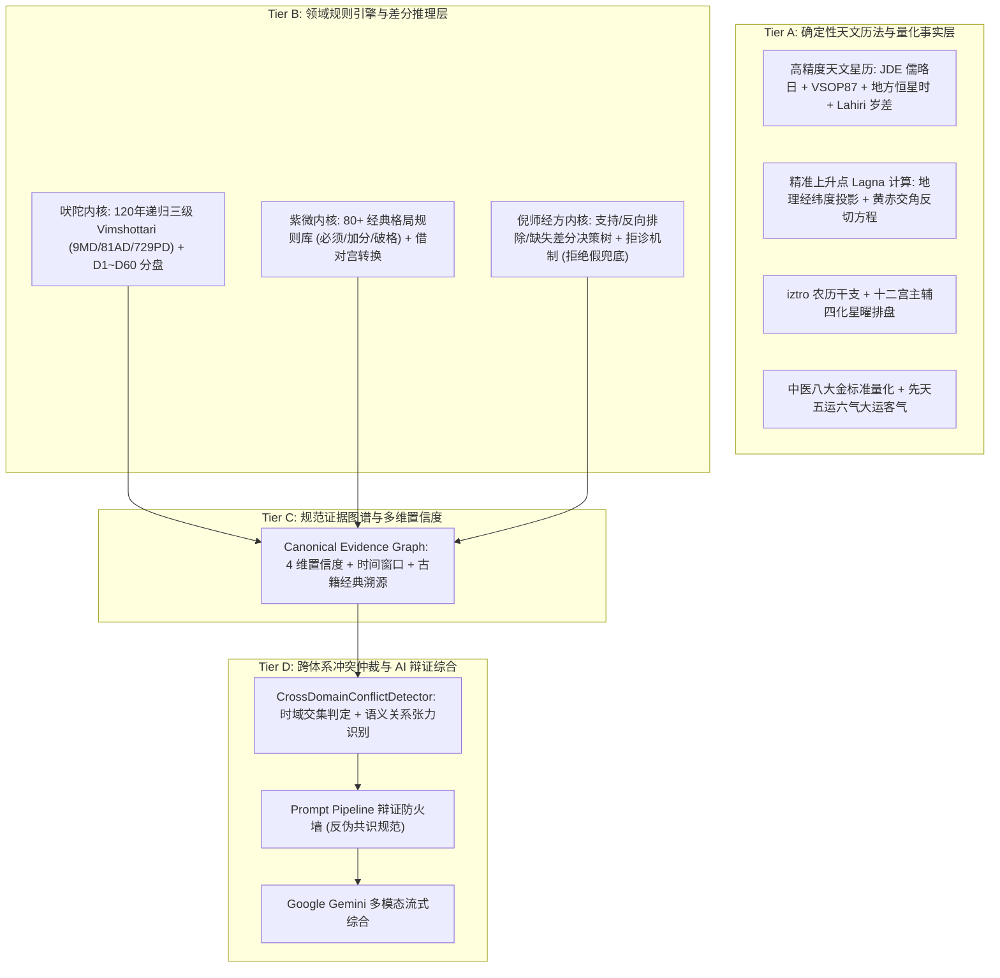

# 🔮 Mystic - Multi-Domain AI Wisdom & Interpretable Reasoning Suite

<p align="center">
  <a href="LICENSE"></a>
  <a href="https://nextjs.org/"></a>
  <a href="https://ai.google.dev/"></a>
  <a href="https://github.com/MeiSiristhebest/mystic/actions"></a>
</p>

<p align="center">
  <a href="README.md">🇨🇳 中文</a> &nbsp;|&nbsp; <a href="README_EN.md">🇺🇸 English</a>
</p>

---

<p align="center">
  <strong>基于确定性事实约束与规范证据图谱的多领域可解释 AI 推演引擎</strong><br/>
  <em>四层解耦架构 · 高精度天文星历 · 差分辨证决策树 · 证据图谱四维置信度 · 跨体系时空张力仲裁</em>
</p>

<p align="center">
  
</p>

---

## 目录 (Table of Contents)

- [项目简介 (About)](#项目简介-about)
- [核心架构：四层解耦模型 (Architecture)](#核心架构四层解耦模型-architecture)
- [核心领域推演引擎 (Domain Engines)](#核心领域推演引擎-domain-engines)
  - [1. 吠陀占星天文与运势内核 (Vedic Jyotish & Ephemeris Engine)](#1-吠陀占星天文与运势内核-vedic-jyotish--ephemeris-engine)
  - [2. 倪海厦经方差分辨证系统 (Ni Haixia Differential TCM Engine)](#2-倪海厦经方差分辨证系统-ni-haixia-differential-tcm-engine)
  - [3. 紫微斗数排盘与格局引擎 (Ziwei Doushu Astrolabe Engine)](#3-紫微斗数排盘与格局引擎-ziwei-doushu-astrolabe-engine)
  - [4. 跨体系时空冲突检测与辩证防火墙 (Cross-Domain Dialectics)](#4-跨体系时空冲突检测与辩证防火墙-cross-domain-dialectics)
- [自动化验证与 CI 体系 (Verification & Quality Harness)](#自动化验证与-ci-体系-verification--quality-harness)
- [环境要求与安装 (Installation & Setup)](#环境要求与安装-installation--setup)
- [许可证 (License)](#许可证-license)

---

## 项目简介 (About)

**Mystic** 是一套构建在 **Next.js 16 (App Router)**、**React 19**、**TypeScript 6** 与 **`@google/genai` (Gemini API v2)** 之上的**多领域结构化可解释 AI 推演引擎**。

传统的玄学与命理 AI 往往直接将出生日期或主观提问粗暴地作为 Prompt 丢给大语言模型，导致极易产生“巴纳姆效应”套话、事实捏造与虚假的多系统一致性幻觉。

**Mystic 拒绝简单的 Prompt 套壳。** 本项目在前端交互与大模型生成之间，建立了一套严密的**确定性计算与规则推理中枢**：
1. **高精度天文与历法事实先行**：集成儒略日（JD）、VSOP87 高精度星历、恒星时（LST）与 Lahiri 恒星黄道岁差校正，确保底层输入客观真实。
2. **确定性规则树与差分判定**：中医正反指征排除法、紫微 80+ 经典格局规则、吠陀 7-Karaka 梯队，均由程序逻辑确定性产出，杜绝胡乱猜测。
3. **结构化证据图谱 (Canonical Evidence Graph)**：每条推演均携带 `calculation`、`inputCompleteness`、`ruleMatch`、`sourceAuthority` 4 维置信度解构及时间作用域（Temporal Scope）。
4. **跨体系张力与时空冲突仲裁**：识别多体系在相同时间窗口内的语义张力（如表层机遇 vs 底层体质赤字），通过 Prompt Firewall 强制指导 LLM 开展辩证综合。

---

## 核心架构：四层解耦模型 (Architecture)



---

## 核心领域推演引擎 (Domain Engines)

### 1. 吠陀占星天文与运势内核 (Vedic Jyotish & Ephemeris Engine)
- **高精度星历运算**：基于标准儒略日与天体力学模型，精准解算九曜（Sun, Moon, Mars, Mercury, Jupiter, Venus, Saturn, Rahu, Ketu）真实真黄道度数与逆行态。
- **恒星黄道与上升点**：采用严格 Chitrapaksha (Lahiri) Ayanamsa（岁差公式）与地方恒星时解算 Lagna。
- **120 年全量三级 Dasha 递归**：精准推演 9 大运 (Maha) $\to$ 81 中运 (Antar) $\to$ 729 小运 (Pratyantar) 连续无缝时间轴。
- **扩展分盘 (Vargas)**：支持 D1 (本命), D7 (子息), D9 (九分婚恋), D10 (十分事业), D12 (父母), D60 (微细因果盘)。
- **7-Chara Karaka**：按度数降序严密编排 Atmakaraka (灵魂星) 至 Darakaraka (伴侣星)。

### 2. 倪海厦经方差分辨证系统 (Ni Haixia Differential TCM Engine)
- **差分辨证协议**：引入正向支持（Positive）、反向排除（Negative Contraindications）与缺失信息追问（Missing Observations）。
- **坚决拒绝伪兜底**：彻底废除“无匹配即默认小柴胡汤”的粗糙逻辑；指征不足时明确返回 `insufficient_evidence` 并输出四诊追问清单。
- **经方古籍条文溯源**：直连《伤寒论》《金匮要略》100% 真实条文出处、经典药对配伍与禁忌警戒。

### 3. 紫微斗数排盘与格局引擎 (Ziwei Doushu Astrolabe Engine)
- **12 宫 108 星曜全盘解构**：基于 iztro 纯 TypeScript 算法，严密计算十二宫、身宫、三方四正、大限流年与四化互冲。
- **80+ 经典格局规则库**：覆盖君臣庆会、杀破狼、机月同梁、三奇加会、日月同宫、日照雷门等经典上中下格与破格条件判定。

### 4. 跨体系时空冲突检测与辩证防火墙 (Cross-Domain Dialectics)
- **时域感知冲突判定**：结合各个系统的 `temporalScope`（大运区间/行运周期）与 `dimension`（事业/健康/心性）。
- **反伪共识防火墙**：当检测到正面吉象与底层收敛/真阳负荷并存时，强制 LLM 进行多角度辩证分析，拒绝生硬抹平分歧。

---

## 自动化验证与 CI 体系 (Verification & Quality Harness)

项目内置 4 层自动化质量门禁体系（接入 GitHub Actions）：
* **L1 运行健全性测试**：确保所有模块纯函数安全执行、零未捕获异常。
* **L2 结构完整性校验**：12 宫完整性、14 主星落宫无遗漏、9/81/729 Dasha 连续无重叠校验。
* **L3 领域黄金真值断言**：断言真实行星顺序、必命中格局、古籍经方组成及缺失指征拒绝机制。
* **L4 外部引擎差分测试**：将 Mystic 适配器排盘与 `iztro` 原始底层核心进行 1:1 差分比对。

```bash
# 运行 L3 Golden 与 L4 Differential 领域测试
pnpm test

# 运行 4-Tier 全维回归测试
pnpm test:all

# 全量编译与验证
pnpm verify
```

---

## 环境要求与安装 (Installation & Setup)

* **Node.js**：`>= 22.13` (推荐 Node 22 LTS)
* **Package Manager**：`pnpm >= 11.1.2` (自带 Corepack 支持)

```bash
# 1. 克隆代码仓库
git clone https://github.com/MeiSiristhebest/mystic.git
cd mystic

# 2. 启用 Corepack 并安装依赖
corepack enable
pnpm install

# 3. 配置环境变量 (.env.local)
GEMINI_API_KEY=your_gemini_api_key

# 4. 启动本地开发服务
pnpm dev
```

---

## 许可证 (License)

本项目采用 [MIT License](LICENSE) 开源许可证。
