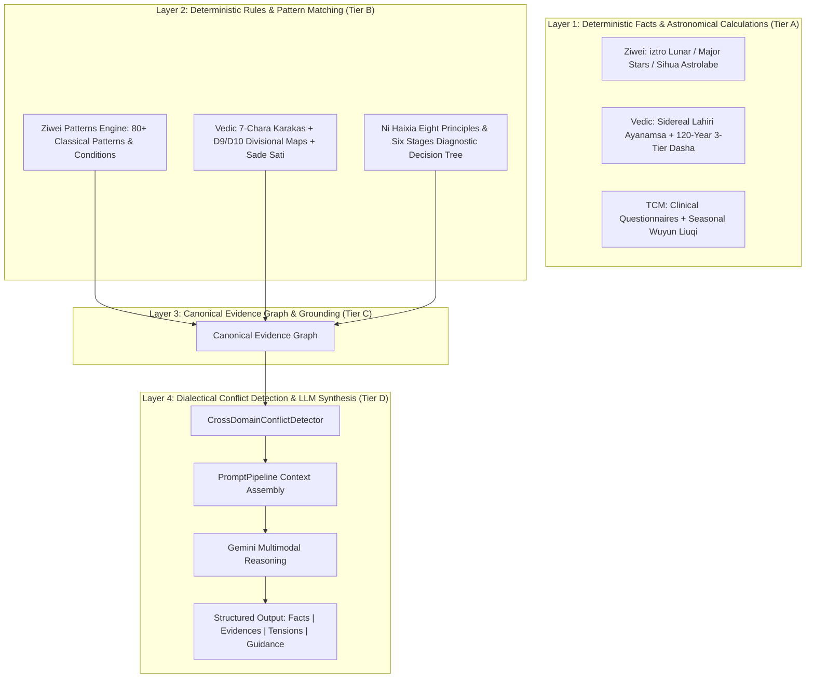

# 🔮 Mystic - Multi-Domain AI Wisdom & Interpretable Reasoning Suite

<p align="center">
  <a href="LICENSE"></a>
  <a href="https://nextjs.org/"></a>
  <a href="https://ai.google.dev/"></a>
  <a href="https://firebase.google.com/"></a>
</p>

<p align="center">
  <a href="README.md">🇨🇳 中文</a> &nbsp;|&nbsp; <a href="README_EN.md">🇺🇸 English</a>
</p>

---

<p align="center">
  <strong>Multi-Domain Interpretable AI Reasoning Suite Grounded in Deterministic Facts & Rule Engines</strong><br/>
  <em>4-Tier Decoupled Architecture · Canonical Evidence Graph · Cross-Domain Dialectical Conflict Resolution · Strict Astronomical & Clinical Validation</em>
</p>

<p align="center">
  
</p>

---

## Table of Contents

- [About](#about)
- [Architecture: The 4-Tier Decoupled Model](#architecture-the-4-tier-decoupled-model)
- [Core Domain Engines](#core-domain-engines)
  - [1. Vedic Jyotish Engine](#1-vedic-jyotish-engine)
  - [2. Ni Haixia TCM Classical Medicine Engine](#2-ni-haixia-tcm-classical-medicine-engine)
  - [3. Ziwei Doushu Pattern & Sihua Engine](#3-ziwei-doushu-pattern--sihua-engine)
  - [4. Cross-Domain Conflict Detection & Dialectics](#4-cross-domain-conflict-detection--dialectics)
- [Requirements & Installation](#requirements--installation)
- [Project Structure](#project-structure)
- [Contributing & Security](#contributing--security)
- [License](#license)

---

## About

**Mystic** is a **multi-domain structured and interpretable AI reasoning engine** built upon **Next.js 14 App Router** and **Google Gemini API**.

Conventional astrology and esoteric AI applications typically dump raw birth dates or open-ended user questions directly into an LLM prompt, inevitably causing Barnum effect platitudes, hallucinated planetary positions, and pseudo-consensus across disparate systems.

**Mystic rejects prompt-wrapper simplifications.** Between the client interface and LLM generation, Mystic implements a rigorous **deterministic computation, rule evaluation, and evidence arbitration core**:
1. **Deterministic Facts First**: Astronomical longitudes, sidereal ayanamsa, divisional charts, and physiological metrics are 100% computed by pure algorithms.
2. **Deterministic Rule Trees & Pattern Engines**: Six-Stage diagnostic trees, Ziwei classical patterns, and Vedic Karaka schemes are evaluated by standalone rule engines linked to canonical texts.
3. **Structured Canonical Evidence Graph**: Every conclusion carries an explicit, traceable `EvidenceNode`.
4. **Cross-Domain Tension Representation**: Transparently reveals conflicting insights across different disciplines (e.g., Ziwei expansion vs. Vedic Saturn contraction) rather than fabricating fake consensus.

---

## Architecture: The 4-Tier Decoupled Model



| Tier | Nature | Responsibility | Typical Output |
| :--- | :--- | :--- | :--- |
| **Tier A: Facts** | 100% Deterministic | Planetary degrees, houses, Ganzhi, Nakshatra, Dasha spans | `VedicPlanetPosition`, `ZiweiChart`, `WuyunLiuqi` |
| **Tier B: Rules** | 100% Deterministic | Rule criteria, pattern conditions, decision tree routing | `DiagnosticRuleMatch`, `PatternCondition` |
| **Tier C: Evidence** | Canonical Knowledge | Classical citations, formula compositions, verbatim quotes | `CanonicalEvidenceNode[]` |
| **Tier D: Synthesis** | Generative Dialectics | Multi-system tension arbitration, anti-hallucination guard | Structured Markdown Audit Report |

---

## Core Domain Engines

### 1. Vedic Jyotish Engine
- **Sidereal Conversion**: True Citra (Lahiri Ayanamsa) precession adjustment.
- **3-Tier Recursive Vimshottari Dasha Engine**:
  - Full 120-year cycle calculation: **9 Mahadashas (MD) $\to$ 81 Antardashas (AD) $\to$ 729 Pratyantardashas (PD)**.
  - Precisely offsets pre-birth elapsed duration from natal Moon Nakshatra degree to ensure seamless continuity.
- **Divisional Charts & Karakas**:
  - D1 (Rasi), D9 (Navamsa for inner dharma/marriage), D10 (Dasamsa for career achievement).
  - 7-Chara Karaka scheme (AK Atmakaraka, AmK Amatyakaraka, DK Darakaraka, etc.).
  - 7.5-year Sade Sati Saturn transit monitoring.
- **16-Point Structural Validation Layer**: Automatically checks degree bounds, graha completeness, divisional integrity, and non-overlapping timeline spans.

### 2. Ni Haixia TCM Classical Medicine Engine
- **8 Gold Health Standards**: Quantified radar scoring for sleep, appetite, thirst, bowel, urination, temperature, sweating, and vitality.
- **Deterministic Six-Stage Diagnostic Rule Tree (`rules.ts`)**:
  - Automatically classifies syndromes across Taiyang, Yangming, Shaoyang, Taiyin, Shaoyin, and Jueyin.
  - Links to exact Shanghan Lun & Jingui Yaolue clauses (e.g., Clause 12, Clause 96, Clause 326).
  - Matches classic formulas (Guizhi Tang, Mahuang Tang, Xiaochaihu Tang, Baihu Tang, Lizhong Tang, Linggui Zhugan Tang, Zhenwu Tang, Wumei Wan) with pharmacology, contraindications, and dietary therapies.
- **Canonical Clinical Case Few-Shots**: Retrieves matching clinical cases from Master Ni Haixia's records as grounded evidence anchors.

### 3. Ziwei Doushu Pattern & Sihua Engine
- **Astrolabe Calculation**: Powered by `iztro` and `lunar-javascript`, generating 12 palaces, stem-branch coordinates, major/minor stars, and body palaces.
- **80+ Classical Pattern Engine (`patterns.ts`)**:
  - Sanfang Sizheng (trine/square), opposite palace borrowing, and adjacent palace flanking.
  - Detects Sanqi Jiahui, Zifu Tonggong, Jixiang Liming, Shapolang, Jiyue Tongliang, Riyue Fanbei, etc.
  - Outputs `PatternCondition` (required, bonus, breaking criteria) with classical citations.
- **Canonical Evidence Tagging**: Automatically classifies dimensions (`career`, `wealth`, `relationship`, `health`).

### 4. Cross-Domain Conflict Detection & Dialectics
- **`CrossDomainConflictDetector`**:
  - Scans `CanonicalEvidenceNode` items across active domains to identify polarity and timing tensions.
  - Distinguishes **Direct Contradictions**, **Timing Mismatches**, and **Surface Opportunity vs. Root Vitality Deficit**.
- **Anti-Pseudo-Consensus Policy**:
  - Forbids artificial smoothing or false claims of universal agreement.
  - Articulates individual system arguments, advising balanced "defensive progression" strategies.

---

## Requirements & Installation

| Requirement | Specification | Description |
|:------------|:--------------|:------------|
| **Node.js** | 18.0+ | Next.js 14 App Router Runtime |
| **pnpm / npm** | pnpm v9+ recommended | Package management |
| **Gemini API Key** | Required | Available from [Google AI Studio](https://aistudio.google.com/) |
| **Firebase** | Optional | Required only for Collective Mirror mode |

### Quick Start

```bash
# 1. Clone the repository
git clone https://github.com/MeiSiristhebest/mystic.git
cd mystic

# 2. Install dependencies
pnpm install

# 3. Configure environment variables
cp .env.example .env.local
# Set your GEMINI_API_KEY in .env.local

# 4. Start local development server
pnpm run dev
```

Visit `http://localhost:3000` to access the application.

---

## Project Structure

```text
mystic/
├── app/                            # Next.js App Router pages, components & server actions
│   ├── actions/                    # Server Actions (Backend calculation & API gateway)
│   ├── components/                 # UI components (VedicApp, RenjiApp, BaziApp, etc.)
│   └── globals.css                 # Glassmorphism design tokens & styles
├── lib/                            # Domain reasoning cores & calculation engines
│   ├── contracts/                  # Canonical Evidence Node & Validation contracts
│   ├── vedic/                      # Vedic Jyotish engine (Lahiri, recursive Dasha, validation)
│   ├── nihaixia/                   # Ni Haixia TCM engine (Diagnostic trees, 8 standards, cases)
│   ├── ziwei/                      # Ziwei Doushu engine (iztro adapter, 80+ patterns, Sihua)
│   ├── reasoning/                  # CrossDomainConflictDetector & dialectics
│   ├── prompts/                    # Context assembly pipeline (PromptPipeline, Plugins, Personas)
│   └── services/                   # Service layer (AstrologyService, TCMService, EasternService)
├── public/                         # Static assets & PWA manifest
└── README.md                       # Documentation
```

---

## Contributing & Security

Contributions are welcome! Before submitting a pull request, please ensure:
1. `pnpm exec tsc --noEmit` runs without type errors.
2. Calculations and LLM prompt context remain strictly decoupled in accordance with the 4-tier architecture.

**Security & Disclaimer**: Content generated by this system is intended for traditional cultural exploration, philosophical study, and general lifestyle self-care. It does not constitute clinical medical diagnosis, legal counsel, or professional financial advice.

---

## License

Released under the **MIT License**. See [LICENSE](LICENSE) for details.
