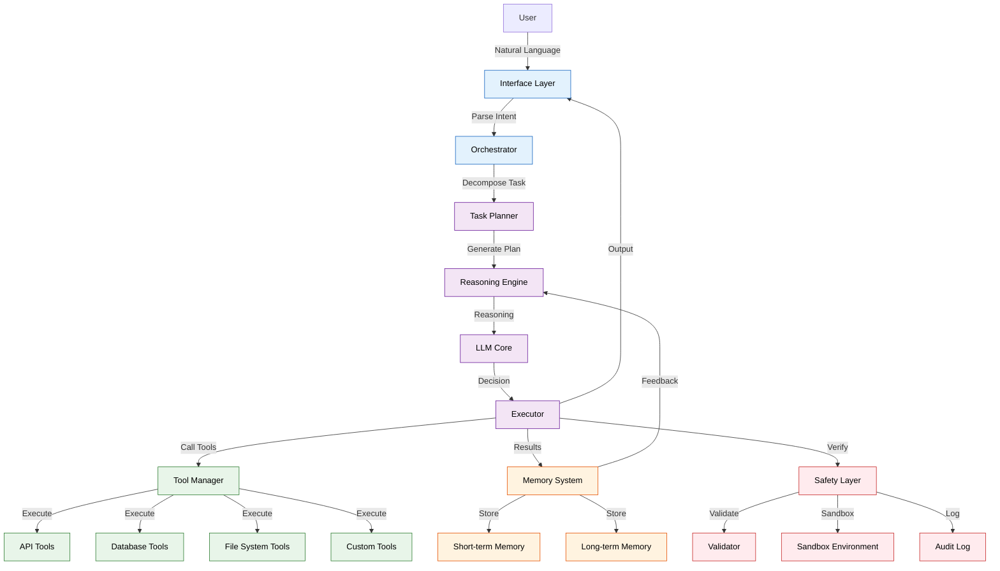
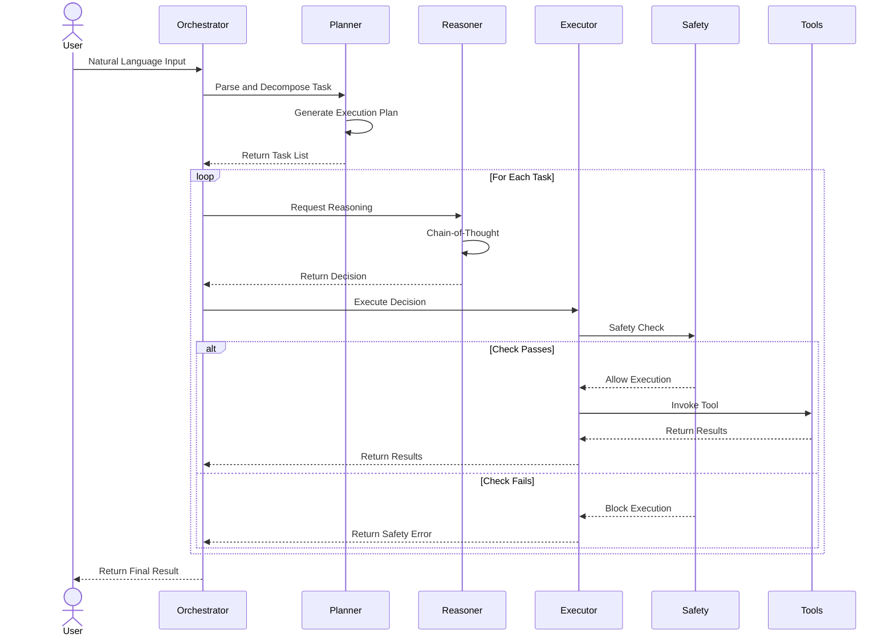

# ✨ Mystic

<p align="center">
  <strong>A Python-based AI framework for building autonomous agents with LLM-powered decision-making</strong>
</p>

<p align="center">
  <a href="https://github.com/MeiSiristhebest/mystic/actions/workflows/ci.yml"></a>
  <a href="https://github.com/MeiSiristhebest/mystic/blob/main/LICENSE"></a>
  
  
  
  
</p>

---

<p align="center">
  <a href="README.md">🇨🇳 中文</a> &nbsp;·&nbsp; <a href="README_EN.md">🇺🇸 English</a>
</p>

---

## 🌟 Overview

**Mystic** is a Python-based AI framework for building autonomous agents with LLM-powered decision-making. It enables agents to understand complex instructions, plan execution steps, call external tools, and make intelligent judgments in uncertain environments.

The core philosophy of Mystic is **"Think Before You Act"**. Each agent engages in internal reasoning before executing tasks, evaluates multiple action plans, selects the optimal strategy, and learns from execution results.

---

## 🛠️ Core Features

| Feature | Description |
|---------|-------------|
| 🧠 **LLM-Powered Reasoning** | Chain-of-Thought reasoning based on mainstream LLMs |
| 🎯 **Autonomous Decision-Making** | Agents independently assess environment state and select optimal actions |
| 🔧 **Tool Invocation** | Support for calling external APIs, databases, file systems, etc. |
| 🔄 **Memory System** | Short-term + Long-term memory; agents remember history and learn from it |
| 🛡️ **Action Validation** | Safety checks before actions to prevent dangerous operations |
| 📊 **Observability** | Complete execution logs and traces for debugging and optimization |
| ⚡ **Async Support** | Fully async architecture supporting concurrent execution |
| 🧩 **Plugin System** | Extensible plugin system for easy capability additions |

---

## 🏗️ Architecture

### Overall Architecture



### Agent Execution Flow



---

## 📦 Project Structure

```text
mystic/
├── mystic/                         # Core Package
│   ├── __init__.py
│   ├── agent/                      # Agent Core
│   │   ├── base_agent.py           # Base Agent Class
│   │   ├── planner.py              # Task Planner
│   │   ├── reasoner.py             # Reasoning Engine
│   │   └── executor.py             # Executor
│   ├── memory/                     # Memory System
│   │   ├── short_term.py           # Short-term Memory
│   │   ├── long_term.py            # Long-term Memory
│   │   └── manager.py              # Memory Manager
│   ├── tools/                      # Tools
│   │   ├── api_tools.py            # API Tools
│   │   ├── db_tools.py             # Database Tools
│   │   ├── file_tools.py           # File System Tools
│   │   └── custom.py               # Custom Tools Base
│   ├── safety/                     # Safety
│   │   ├── validator.py            # Action Validator
│   │   ├── sandbox.py              # Sandbox Environment
│   │   └── audit.py                # Audit Logger
│   ├── llm/                        # LLM Integration
│   │   ├── base_provider.py        # Base LLM Provider
│   │   ├── openai_provider.py      # OpenAI Provider
│   │   └── config.py               # LLM Config
│   └── utils/                      # Utilities
│       ├── logging.py              # Logging
│       └── helpers.py              # Helpers
├── examples/                       # Examples
│   ├── simple_agent.py             # Simple Agent Example
│   ├── tool_use.py                 # Tool Use Example
│   └── custom_agent.py             # Custom Agent Example
├── tests/                          # Tests
├── docs/                           # Documentation
├── pyproject.toml                  # Project Config
└── README.md
```

---

## 🚀 Quick Start

### Installation

```bash
# Install from PyPI (recommended)
pip install mystic-framework

# Or install from source
git clone https://github.com/MeiSiristhebest/mystic.git
cd mystic
pip install -e .
```

### Basic Usage

```python
import asyncio
from mystic import Agent
from mystic.llm import LLMConfig

# Configure LLM
llm_config = LLMConfig(
    provider="openai",
    model="gpt-4o",
    api_key="your-api-key"
)

# Create Agent
agent = Agent(
    name="my-agent",
    llm_config=llm_config,
    tools=["file", "api", "database"]
)

async def main():
    # Run Agent
    result = await agent.run(
        "Read data/input.csv, analyze data, generate a summary report, save as output/summary.txt"
    )
    print(result)

asyncio.run(main())
```

### Using Custom Tools

```python
from mystic.tools import CustomTool

class WeatherTool(CustomTool):
    name = "weather"
    description = "Get weather for a specified city"
    parameters = {
        "city": {"type": "string", "description": "City name"}
    }

    async def execute(self, city: str) -> dict:
        # Implement weather query logic
        response = await self.http_client.get(
            f"https://api.weather.com/{city}"
        )
        return {"city": city, "temperature": response["temp"]}

# Register custom tool
agent.register_tool(WeatherTool())

# Use
result = await agent.run("Query today's weather in Beijing")
```

### Multi-Agent Collaboration

```python
from mystic import Agent, Orchestrator

# Create multiple agents
researcher = Agent(name="researcher", tools=["web", "database"])
writer = Agent(name="writer", tools=["file"])
critic = Agent(name="critic", tools=["file"])

# Create orchestrator
orchestrator = Orchestrator(
    agents=[researcher, writer, critic],
    collaboration_mode="sequential"  # or "parallel"
)

# Run multi-agent collaboration
result = await orchestrator.run(
    "Research latest progress in quantum computing, write a science article, then perform critical review"
)
```

---

## ⚙️ Configuration

### LLM Provider Configuration

```python
from mystic.llm import LLMConfig

# OpenAI
config = LLMConfig(
    provider="openai",
    model="gpt-4o",
    api_key="your-api-key",
    temperature=0.7,
    max_tokens=4096
)

# Other providers
config = LLMConfig(
    provider="anthropic",
    model="claude-sonnet-4-20250514",
    api_key="your-api-key"
)
```

### Safety Configuration

```python
from mystic.safety import SafetyConfig

safety_config = SafetyConfig(
    enable_sandbox=True,
    max_api_calls=10,
    blocked_patterns=["rm -rf /", "DROP TABLE"],
    require_human_approval=True,
    audit_all_actions=True
)

agent = Agent(
    llm_config=llm_config,
    safety_config=safety_config
)
```

### Memory Configuration

```python
from mystic.memory import MemoryConfig

memory_config = MemoryConfig(
    short_term_capacity=100,
    long_term_enabled=True,
    embedding_model="text-embedding-3-small",
    max_history_days=90
)

agent = Agent(
    llm_config=llm_config,
    memory_config=memory_config
)
```

---

## 🔒 Security

### Usage Guidelines

- **API Key Security**: Never hardcode API keys; use environment variables or secrets management services.
- **Permission Control**: In production, configure agents with the principle of least privilege; only open necessary tools.
- **Sandbox Execution**: Execute dangerous operations in sandbox environments to avoid impacting production systems.
- **Audit Logs**: Enable audit logging to record all agent action traces.
- **Human Review**: Enable human review mode at key decision points.

### Vulnerability Disclosure

Send suspected issues **by email** to: **`maox_neta@foxmail.com`**. We commit to first response within 48 hours, with critical bugs receiving a hotfix and public thanks within 72 hours.

---

## 📄 License

**Mystic** is released under the **MIT License**. This means:

- ✅ You may freely modify, use commercially, or re-distribute this project
- ✅ A copy of the MIT license text plus the copyright notice must be preserved in derivative works
- ❌ The authors accept no liability for any direct or indirect damages arising from use

**Copyright:** Copyright (c) 2025-2026 MeiSiristhebest. All Rights Reserved.

Full license text: [`LICENSE`](LICENSE).
