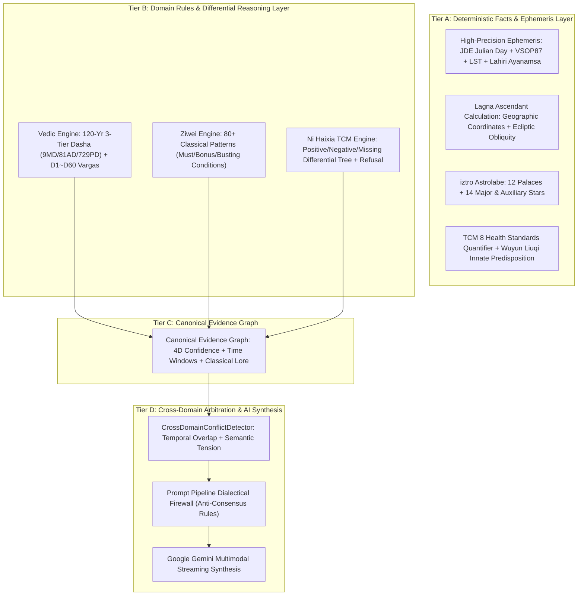

# 🔮 Mystic - Multi-Domain AI Wisdom & Interpretable Reasoning Suite

<p align="center">
  <a href="LICENSE"></a>
  <a href="https://nextjs.org/"></a>
  <a href="https://ai.google.dev/"></a>
  <a href="https://github.com/MeiSiristhebest/mystic/actions"></a>
</p>

<p align="center">
  <a href="README.md">🇨🇳 中文</a> &nbsp;|&nbsp; <a href="README_EN.md">🇺🇸 English</a>
</p>

---

<p align="center">
  <strong>Deterministic Domain & Evidence-Grounded Multi-Domain AI Reasoning Engine</strong><br/>
  <em>4-Tier Decoupled Architecture · High-Precision Ephemeris · Differential TCM Diagnosis · Multi-Factor Confidence · Cross-Domain Dialectical Arbitration</em>
</p>

<p align="center">
  
</p>

---

## Table of Contents

- [About the Project](#about-the-project)
- [4-Tier Decoupled Architecture](#4-tier-decoupled-architecture)
- [Deterministic Domain Engines](#deterministic-domain-engines)
  - [1. Vedic Jyotish & Ephemeris Engine](#1-vedic-jyotish--ephemeris-engine)
  - [2. Ni Haixia Differential TCM Engine](#2-ni-haixia-differential-tcm-engine)
  - [3. Ziwei Doushu Astrolabe Engine](#3-ziwei-doushu-astrolabe-engine)
  - [4. Cross-Domain Conflict & Dialectic Firewall](#4-cross-domain-conflict--dialectic-firewall)
- [Automated Verification & CI Harness](#automated-verification--ci-harness)
- [Installation & Setup](#installation--setup)
- [License](#license)

---

## About the Project

**Mystic** is a **multi-domain structured and interpretable AI reasoning engine** built on **Next.js 16 (App Router)**, **React 19**, **TypeScript 6**, and **`@google/genai` (Gemini API v2)**.

Traditional metaphysical/astrology AI applications dump raw birth information or subjective user questions directly into an LLM prompt, inevitably causing Barnum-effect platitudes, hallucinations, and false cross-domain consensus.

**Mystic refuses to be a naive prompt wrapper.** It establishes a strict deterministic computation and reasoning firewall between user interaction and LLM synthesis:
1. **Deterministic Ephemeris & Astronomical Truth**: Astronomical longitudes, Julian Days, LST, and sidereal Chitrapaksha Lahiri ayanamsa are 100% computed via pure mathematical algorithms.
2. **Deterministic Rules & Differential Diagnostics**: TCM positive/negative exclusion trees, Ziwei 80+ patterns, and Vedic 7-Chara Karakas are evaluated deterministically with authentic classical citations.
3. **Canonical Evidence Graph**: Every insight is anchored to a structured `CanonicalEvidenceNode` with 4-dimensional confidence breakdown (`calculation`, `inputCompleteness`, `ruleMatch`, `sourceAuthority`) and temporal scopes.
4. **Cross-Domain Temporal Tension Arbitration**: Evaluates real tensions across disciplines within overlapping time windows (e.g., surface opportunity vs. somatic energy deficits), instructing the LLM to provide dialectical depth without forced consensus.

---

## 4-Tier Decoupled Architecture



---

## Deterministic Domain Engines

### 1. Vedic Jyotish & Ephemeris Engine
- **Astronomical Ephemeris**: Calculates real geocentric longitudes and retrograde statuses for the 9 Grahas (Sun, Moon, Mars, Mercury, Jupiter, Venus, Saturn, Rahu, Ketu).
- **Sidereal Lagna**: Uses Local Sidereal Time and Chitrapaksha (Lahiri) Ayanamsa.
- **120-Year 3-Tier Recursive Dasha**: Seamless timeline across 9 Mahadashas $\to$ 81 Antardashas $\to$ 729 Pratyantardashas.
- **Extended Vargas**: D1 (Natal), D7 (Saptamsa), D9 (Navamsa), D10 (Dasamsa), D12 (Dwadasamsa), D60 (Shashtiamsa).
- **7-Chara Karakas**: Descending order from Atmakaraka (AK) to Darakaraka (DK).

### 2. Ni Haixia Differential TCM Engine
- **Differential Protocol**: Evaluates positive indicators, negative exclusion contraindications, and missing clinical observations.
- **Refusal on Insufficient Evidence**: Rejects false diagnoses when symptoms are vague, returning an exact checklist of missing observations instead of defaulting to a formula.
- **Authentic Classical Lore**: Direct citations from *Shanghan Lun* and *Jingui Yaolüe*.

### 3. Ziwei Doushu Astrolabe Engine
- **Full Astrolabe Deconstruction**: 12 Palaces, 108 Stars, Body Palace, San Fang Si Zheng, Mutagens (Si Hua), and Decadal Luck via `iztro`.
- **80+ Classical Patterns**: Rigorous evaluation of auspicious, neutral, and afflicted configurations.

### 4. Cross-Domain Conflict & Dialectic Firewall
- **Temporal Scope Awareness**: Identifies overlapping timeframes and distinguishes macro-cycles from acute phases.
- **Anti-Consensus Firewall**: Guides the generative model to present honest dialectical synthesis rather than smoothing away contradictions.

---

## Automated Verification & CI Harness

Built with a 4-tier automated test harness wired directly into GitHub Actions:
* **L1 Execution Health**: Zero runtime exceptions in pure functional units.
* **L2 Structural Integrity**: 12 palaces, 14 major stars completeness, and 9/81/729 Dasha continuity.
* **L3 Domain Golden Values**: Precise assertions on planetary sequences, matched patterns, classical herbs, and refusal mechanics.
* **L4 Differential Testing**: 1:1 parity check between Mystic adapter and raw `iztro` engine.

```bash
# Run L3 Golden & L4 Differential Tests
pnpm test

# Run 4-Tier Full Regression Suite
pnpm test:all

# Full Typecheck & Production Build Verification
pnpm verify
```

---

## Installation & Setup

* **Node.js**: `>= 22.13` (Node 22 LTS recommended)
* **Package Manager**: `pnpm >= 11.1.2` (with native Corepack support)

```bash
# 1. Clone repository
git clone https://github.com/MeiSiristhebest/mystic.git
cd mystic

# 2. Enable Corepack and install dependencies
corepack enable
pnpm install

# 3. Configure environment variables (.env.local)
GEMINI_API_KEY=your_gemini_api_key

# 4. Start local development server
pnpm dev
```

---

## License

This project is licensed under the [MIT License](LICENSE).
