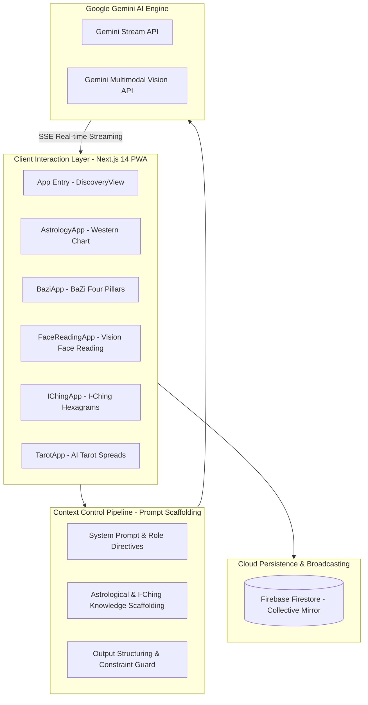
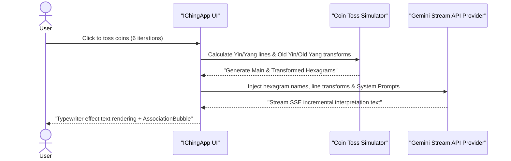

# 🔮 Mystic - Gemini Multimodal AI Wisdom & Astrology Suite

<p align="center">
  <a href="LICENSE"></a>
  <a href="https://nextjs.org/"></a>
  <a href="https://ai.google.dev/"></a>
  <a href="https://firebase.google.com/"></a>
</p>

<p align="center">
  <a href="README.md">🇨🇳 中文</a> &nbsp;|&nbsp; <a href="README_EN.md">🇺🇸 English</a>
</p>

---

<p align="center">
  <strong>Gemini Multimodal AI Wisdom & Astrology Suite · 8 Inference Modalities · Zero-Hallucination Context Pipeline</strong>
</p>

<p align="center">
  
</p>

---

## Table of Contents

- [About](#about)
- [Features](#features)
- [Requirements](#requirements)
- [Installation](#installation)
- [Quick Start](#quick-start)
- [Configuration](#configuration)
- [Architecture](#architecture)
- [Project Structure](#project-structure)
- [Tech Stack](#tech-stack)
- [Contributing](#contributing)
- [Security](#security)
- [License](#license)

---

## About

**Mystic** is a modern, high-performance multimodal AI-powered Eastern wisdom, astrology, and spiritual exploration platform built with **Next.js 14 App Router**.

Integrating the **Gemini Stream API** and **Gemini Vision API**, Mystic orchestrates eight wisdom domain engines—including Western Astrology, Eastern BaZi (Four Pillars), Vision-based Face Reading, I-Ching Hexagram divination, ZiWei DouShu, AI Tarot readings, Dream Analysis, and a Firebase-backed Collective Mirror—guarded by a zero-hallucination **Prompt Context Pipeline**.

Key highlights include **Prompt Context Pipeline Control**, **Real-Time SSE Streaming Response Rendering**, **Multimodal Image Feature Extraction**, and complete **Progressive Web App (PWA)** mobile install support.

---

## Features

### Eight Core Wisdom Modules

The system harmonizes ancient Eastern and Western traditions with modern AI:

| # | Modality | Component | Capability |
|:--|:---------|:----------|:-----------|
| 1 | 🌌 Western Astrology | `AstrologyApp` | Calculates planetary aspects, house positions, and birth charts using birth date/time and geographic coordinates for synastry and forecast readings |
| 2 | 🎋 Eastern BaZi | `BaziApp` | Computes Year, Month, Day, and Hour Pillars (GanZhi) with Five Elements strength evaluation |
| 3 | 👁️ Vision Face Reading | `FaceReadingApp` | Uses Gemini Vision API to analyze face photos, identifying three divisions, five features, and facial marks |
| 4 | ☯️ I-Ching Divination | `IChingApp` | Simulates 6 coin tosses to compute Main and Transformed Hexagrams with line transform interpretations |
| 5 | 🎴 AI Tarot | `TarotApp` | Features single-card and 3-card spreads with card flip animations and real-time idea bubbles |
| 6 | 🌙 Dream Analysis | `DreamApp` | Parses dream narratives to construct psychological metaphor maps based on symbol libraries |
| 7 | ✨ Zi Wei Dou Shu | `ZiWeiApp` | Plots 12 palaces and star positions for birth charts |
| 8 | 🪞 Collective Mirror | `CollectiveMirrorApp` | Connects to Firebase Firestore for real-time global user insight sharing and word cloud resonance |

### Platform-Level Capabilities

- **Zero-Hallucination Context Pipeline**: multi-layer System Prompts and domain knowledge constraints keep structured output stable and controllable.
- **Real-Time SSE Streaming**: Gemini Stream API returns incrementally; the frontend renders interpretations with a typewriter effect.
- **Multimodal Vision Reasoning**: Gemini Vision API reads image features directly, with no extra CV preprocessing pipeline.
- **Progressive Web App**: Service Worker plus install prompt, supporting one-tap Add to Home Screen on mobile.

---

## Requirements

| Dependency | Version | Notes |
|:-----------|:--------|:------|
| **Node.js** | 18.0 or higher | Runtime baseline for Next.js 14 App Router |
| **npm** | Bundled with Node.js | Package manager |
| **Gemini API Key** | Required | Obtain one from [Google AI Studio](https://aistudio.google.com/) |
| **Firebase Project** | Optional | Only required by the Collective Mirror module (Firestore instance) |

---

## Installation

```bash
git clone https://github.com/MeiSiristhebest/mystic.git
cd mystic
npm install
```

---

## Quick Start

### 1. Configure Environment Variables

Create a `.env.local` file in the project root and set your Gemini API Key:

```bash
GEMINI_API_KEY="your-google-gemini-api-key"
```

### 2. Start the Local Development Server

```bash
npm run dev
```

### 3. Expected Output

```text
▲ Next.js 14.x.x
- Local:        http://localhost:3000
- Environments: .env.local
✓ Ready in XXX ms
```

Open `http://localhost:3000` in your browser to preview the full system.

---

## Configuration

| Variable | Required | Description |
|:---------|:---------|:------------|
| `GEMINI_API_KEY` | Yes | Google Gemini API key. Used server-side only through Server Actions and never exposed to the browser |

Additional cloud configuration lives in `firebase-applet-config.json` (Firebase realtime cloud config) and `firestore.rules` (Firestore read/write security rules) at the repository root.

---

## Architecture

All architectural components below are fully implemented in this repository. Click any source code link to inspect exact implementation details.

### Context Control Pipeline

Addressing LLM hallucinations in complex reasoning tasks, Mystic features a backend Context Control Pipeline. Each request dynamically concatenates structured System Instructions, domain knowledge rules, and user-supplied spatio-temporal/facial parameters before calling Gemini, ensuring deterministic, structured output.

### Multimodal Reasoning Topology Diagram



### I-Ching Sequence Flow Diagram



### Direct Source Code Links

| Module | Source Path | Responsibility |
|:-------|:------------|:---------------|
| Discovery Navigation | [`app/components/DiscoveryView.tsx`](app/components/DiscoveryView.tsx) | Multimodal navigation and module router |
| Western Astrology | [`app/components/AstrologyApp.tsx`](app/components/AstrologyApp.tsx) | Astrology calculations and Gemini engine |
| Eastern BaZi | [`app/components/BaziApp.tsx`](app/components/BaziApp.tsx) | Four Pillars calculation and Gemini engine |
| Vision Face Reading | [`app/components/FaceReadingApp.tsx`](app/components/FaceReadingApp.tsx) | Gemini Multimodal Vision face analysis |
| I-Ching Divination | [`app/components/IChingApp.tsx`](app/components/IChingApp.tsx) | I-Ching coin tossing and hexagram transforms |
| AI Tarot | [`app/components/TarotApp.tsx`](app/components/TarotApp.tsx) | Tarot spread and dynamic idea bubbles |
| Collective Mirror | [`app/components/CollectiveMirrorApp.tsx`](app/components/CollectiveMirrorApp.tsx) | Firebase-backed Collective Mirror component |
| Association Bubbles | [`app/components/AssociationBubble.tsx`](app/components/AssociationBubble.tsx) | Real-time SSE streaming bubble component |
| Security Rules | [`firestore.rules`](firestore.rules) | Firebase security rules policy |

---

## Project Structure

```text
mystic/
├── app/                            # Next.js 14 App Router Pages & Components
│   ├── actions/                    # Next.js Server Actions (AI API Proxies)
│   ├── api/                        # SSE Streaming Endpoints
│   ├── components/                 # Core Module Components
│   │   ├── AstrologyApp.tsx        # Astrology Module
│   │   ├── BaziApp.tsx             # BaZi Module
│   │   ├── FaceReadingApp.tsx      # Vision Face Reading Module
│   │   ├── IChingApp.tsx           # I-Ching Module
│   │   ├── TarotApp.tsx            # Tarot Module
│   │   ├── CollectiveMirrorApp.tsx # Collective Mirror Module
│   │   ├── AssociationBubble.tsx   # Streaming Idea Bubbles
│   │   └── DiscoveryView.tsx       # Home Navigation Router
│   ├── globals.css                 # Glassmorphism & Gradient Styles
│   ├── layout.tsx                  # PWA Manifest & Root Layout
│   └── page.tsx                    # View Entry Point
├── firebase-applet-config.json     # Firebase Realtime Cloud Config
├── firestore.rules                 # Firestore Security Rules
├── GEMINI.md                       # Architecture & Prompt Specs
└── README.md                       # Main Documentation
```

---

## Tech Stack

| Layer | Core Technology | Role |
|:------|:----------------|:-----|
| **Frontend Framework** | Next.js 14 (App Router) + React 18 | Modern React fullstack framework |
| **Core AI Engine** | Google Gemini API (Stream & Vision) | SSE real-time streaming and multimodal vision |
| **Realtime Cloud DB** | Firebase Firestore | Anonymous collective insight sync |
| **Styling & UI** | TailwindCSS + Glassmorphism UI | Futuristic dark crystal visual system |
| **PWA Experience** | Service Worker + PwaInstallPrompt | Add to Home Screen native mobile support |

---

## Contributing

Contributions welcome. Quick flow:

```bash
# 1. Fork → Clone → Branch
git checkout -b feat/your-feature

# 2. Local build passes
npm run build

# 3. Commit and open a PR
git commit -m "feat: your change"
git push origin feat/your-feature
```

Welcome contribution directions:

- 🌐 Add new wisdom modules (e.g., Plum Blossom Numerology, synastry comparison, etc.)
- 🧪 Add Server Action and component unit tests
- 🎨 Polish visual details or new theme styles
- 📱 Enhance PWA offline experience

---

## Security

| Risk Scenario | Mitigation |
|:--------------|:-----------|
| **Gemini API Key Leak** | `.env.local` is in `.gitignore`; Server Action acts as the sole API proxy exit; the key is only used server-side and never exposed to the browser |
| **Firestore Unauthorized R/W** | `firestore.rules` strictly controls read/write permissions; anonymous collective mirror only allows writing anonymous fields, read permissions based on document ID |
| **Prompt Injection Attack** | Context Control Pipeline multi-layer System Prompt constraints; Output Sanitizer guardrail validates structured format |
| **PWA Service Worker Cache Poisoning** | Production build hashes static assets; Service Worker update strategy uses `skipWaiting` + `clientsClaim` for gradual replacement |

**Vulnerability disclosure**: Report security issues directly to `maox_neta@foxmail.com` — do not file a public issue. We commit to a **first response within 24 hours**.

---

## License

This project is released under the **MIT License**. See the [LICENSE](LICENSE) file for details.
