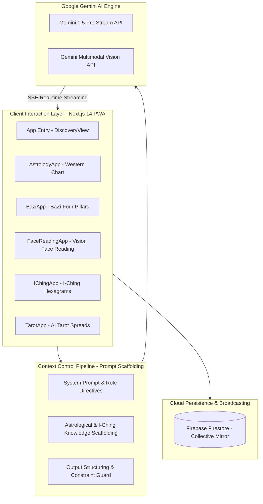
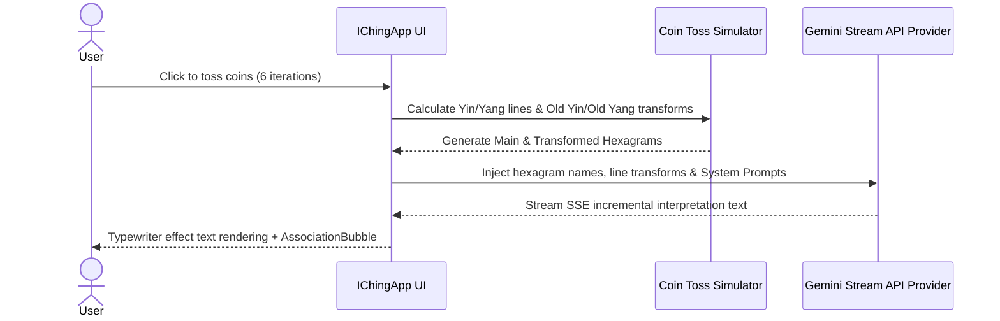

<div align="center">

</div>

# 🔮 Mystic - Gemini Multimodal AI Wisdom & Astrology Suite (玄犀)

[](LICENSE)
[](README_EN.md)
[](README_EN.md)
[](README_EN.md)

[🇨🇳 中文](README.md) | [🇺🇸 English](README_EN.md)

---

## 📖 Introduction

**Mystic (玄犀)** is a multimodal AI-powered Eastern wisdom, astrology, and spiritual exploration platform prototyped on **Google AI Studio** and built with **Next.js 14 App Router**.

Integrating the **Gemini Stream API** and **Gemini Vision API**, Mystic orchestrates eight wisdom domain engines—including Western Astrology, Eastern BaZi (Four Pillars), Vision-based Face Reading, I-Ching Hexagram divination, ZiWei DouShu, AI Tarot readings, Dream Analysis, and a Firebase-backed Collective Mirror—guarded by a zero-hallucination **Prompt Context Pipeline**.

Key highlights include **Prompt Context Pipeline Control**, **Real-Time SSE Streaming Response Rendering**, **Multimodal Image Feature Extraction**, and complete **Progressive Web App (PWA)** mobile install support.

---

## 🛠️ Microservice Core Architecture & Engineering Design

All architectural components below are fully implemented in this repository. Click any source code link to inspect exact implementation details:

### 1. Multimodal AI & Context Control Pipeline 🌌

*   **Architectural Evolution**: Addressing LLM hallucinations in complex reasoning tasks, Mystic features a backend Context Control Pipeline. Each request dynamically concatenates structured System Instructions, domain knowledge rules, and user-supplied spatio-temporal/facial parameters before calling Gemini, ensuring deterministic, structured output.
*   **Multimodal Reasoning Topology Diagram**:



*   **📂 Direct Source Code Links**:
    - [app/components/DiscoveryView.tsx (Multimodal Navigation & Module Router)](app/components/DiscoveryView.tsx)
    - [app/components/AstrologyApp.tsx (Astrology Calculations & Gemini Engine)](app/components/AstrologyApp.tsx)
    - [app/components/BaziApp.tsx (Four Pillars Calculation & Gemini Engine)](app/components/BaziApp.tsx)
    - [app/components/FaceReadingApp.tsx (Gemini Multimodal Vision Face Analysis)](app/components/FaceReadingApp.tsx)
    - [app/components/IChingApp.tsx (I-Ching Coin Tossing & Hexagram Transforms)](app/components/IChingApp.tsx)
    - [app/components/TarotApp.tsx (Tarot Spread & Dynamic Idea Bubbles)](app/components/TarotApp.tsx)

---

### 2. Eight Core Wisdom Modules & Execution Sequences ☯️

The system harmonizes ancient Eastern & Western traditions with modern AI:

1.  **🌌 Western Astrology (AstrologyApp)**: Calculates planetary aspects, house positions, and birth charts using birth date/time and geographic coordinates for synastry and forecast readings.
2.  **🎋 Eastern BaZi (BaziApp)**: Computes Year, Month, Day, and Hour Pillars (GanZhi) with Five Elements strength evaluation.
3.  **👁️ Vision Face Reading (FaceReadingApp)**: Uses Gemini Vision API to analyze face photos, identifying three divisions, five features, and facial marks.
4.  **☯️ I-Ching Divination (IChingApp)**: Simulates 6 coin tosses to compute Main and Transformed Hexagrams with line transform interpretations.
5.  **🎴 AI Tarot (TarotApp)**: Features single-card and 3-card spreads with card flip animations and real-time idea bubbles.
6.  **🌙 Dream Analysis (DreamApp)**: Parses dream narratives to construct psychological metaphor maps based on symbol libraries.
7.  **✨ Zi Wei Dou Shu (ZiWeiApp)**: Plots 12 palaces and star positions for birth charts.
8.  **🪞 Collective Mirror (CollectiveMirrorApp)**: Connects to Firebase Firestore for real-time global user insight sharing and word cloud resonance.

*   **I-Ching Sequence Flow Diagram**:



*   **📂 Direct Source Code Links**:
    - [app/components/CollectiveMirrorApp.tsx (Firebase Collective Mirror Component)](app/components/CollectiveMirrorApp.tsx)
    - [app/components/AssociationBubble.tsx (Real-time SSE Streaming Bubble Component)](app/components/AssociationBubble.tsx)
    - [firestore.rules (Firebase Security Rules Policy)](firestore.rules)

---

## 📂 Project Structure

```text
mystic/
├── app/                            # Next.js 14 App Router Pages & Components
│   ├── actions/                    # Next.js Server Actions (AI API Proxies)
│   ├── api/                        # SSE Streaming Endpoints
│   ├── components/                 # Core Module Components
│   │   ├── AstrologyApp.tsx        # Astrology Module
│   │   ├── BaziApp.tsx             # BaZi Module
│   │   ├── FaceReadingApp.tsx      # Vision Face Reading Module
│   │   ├── IChingApp.tsx           # I-Ching Module
│   │   ├── TarotApp.tsx            # Tarot Module
│   │   ├── CollectiveMirrorApp.tsx # Collective Mirror Module
│   │   ├── AssociationBubble.tsx   # Streaming Idea Bubbles
│   │   └── DiscoveryView.tsx       # Home Navigation Router
│   ├── globals.css                 # Glassmorphism & Gradient Styles
│   ├── layout.tsx                  # PWA Manifest & Root Layout
│   └── page.tsx                    # View Entry Point
├── firebase-applet-config.json     # Firebase Realtime Cloud Config
├── firestore.rules                 # Firestore Security Rules
├── GEMINI.md                       # Google AI Studio Architecture & Prompt Specs
└── README.md                       # Main Documentation
```

---

## 📊 Technology Stack Matrix

| Layer | Core Technology | Role |
|:------|:-----------|:--------|
| **Frontend Framework** | Next.js 14 (App Router) + React 18 | Modern React Fullstack Framework |
| **AI LLM Engine** | Google Gemini 1.5 Pro (Stream & Vision API) | SSE Real-time Streaming & Multimodal Vision |
| **Realtime Cloud DB** | Firebase Firestore | Anonymous Collective Insight Sync |
| **Styling & UI** | TailwindCSS + Glassmorphism UI | Futuristic Dark Crystal Visual System |
| **PWA Experience** | Service Worker + PwaInstallPrompt | Add to Home Screen Native Mobile Support |
| **Prototyping Platform**| Google AI Studio | Prompt Context Verification & API Design |

---

## 🏃 Local Quick Start Guide

### 1. Prerequisites
- **Node.js**: 18.0 or higher
- **Google AI Studio API Key**: Obtain from [Google AI Studio](https://aistudio.google.com/)

### 2. Installation
```bash
git clone https://github.com/MeiSiristhebest/mystic.git
cd mystic
npm install
```

### 3. Environment Setup
Create a `.env.local` file in the root directory:
```env
GEMINI_API_KEY="your-google-gemini-api-key"
```

### 4. Start Local Development Server
```bash
npm run dev
```
Open `http://localhost:3000` in your browser.

---

## 📜 License

Licensed under the [MIT License](LICENSE).
